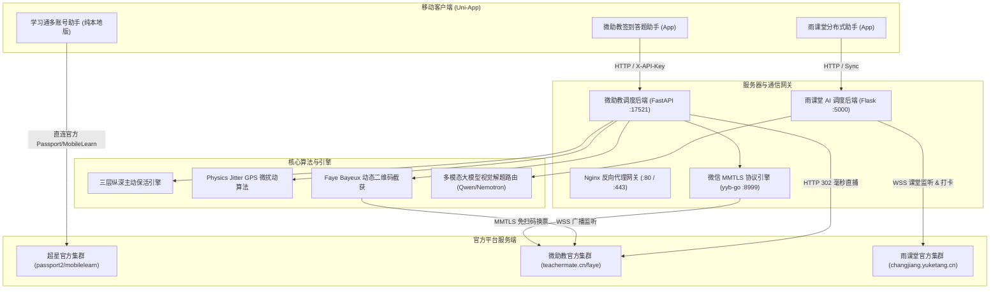

# 协议类 APP 逆向与自动化工程全套开源套件 (Protocol App Reverse Suite)

> ⚠️免责声明：本项目仅供网络安全、计算机编程技术学习研究使用，禁止用于任何违规业务，禁止用于绕过官方限制、非正规批量操作。所有使用者自行承担全部法律与相关责任。

---

## 📌 项目简介

本项目是一套基于真实高校教学与签到平台（**超星学习通**、**微助教**、**雨课堂**）网络通信协议逆向分析的开源工程。项目包含完整的 **Uni-App 跨平台移动客户端（Vue 3 / Vue 2）**、**自研高性能高并发后端服务（Python FastAPI / Flask + Golang MMTLS）**、**三层纵深主动保活引擎**、**多模态 AI 智能视觉答题系统** 与 **全套 Linux 生产级永久常驻部署方案**。

项目已完全清除所有真实用户数据、个人隐私信息与调试垃圾代码，核心业务逻辑、网络协议交互流程、接口 API 地址、签名加密算法、WebSocket 信令交互均 **100% 原样保留**，开箱即可直接本地调试与生产部署。

---

## 🏗️ 系统整体架构图



---

## 🛠️ 技术栈清单

| 分层 | 技术选型 | 核心作用与特性 |
| :--- | :--- | :--- |
| **跨平台客户端** | Vue 3 / Vue 2 + Uni-App | 跨 Android / iOS / H5 原生渲染，Apple 质感 UI，全手势与多账号矩阵 |
| **微助教调度后端** | Python 3.10+ / FastAPI / Uvicorn | 纯无锁极速全并发、302 Location 毫秒直捕、RESTful 接口、Web 控制台 |
| **微信协议底座** | Golang (yyb-go) | 微信 MMTLS 底层双向通信、长效 Token 维护、免扫码换取小程序 Code |
| **雨课堂 AI 后端** | Python 3.10+ / Flask / Waitress | WebSocket 课堂实时信令监听、多模态大模型视觉图像理解、高并发多账号提交 |
| **持久化存储** | SQLite 3 (WAL 模式) + JSON Store | 线程安全、无锁并发读写、冷备份支持 |
| **生产级运维托管** | Docker Compose / Systemd / Nginx / PM2 | 崩溃自愈、日志轮转、HTTPS 自动化证书、守护进程永久常驻 |

---

## 🌟 三套系统核心功能与特性矩阵

### 1. 超星学习通签到系统 (`学习通签到/`)
* **纯本地零依赖**：零服务器要求，所有登录凭据只存储在当前设备的本地沙盒中，100% 离线独立运行。
* **双鉴权登录**：支持【手机号 + 短信验证码】与【手机号 / 学号 / 账号 + 密码】两种模式，内置纯 JS MD5 签名生成算法（`phone + Salt + timestamp`）。
* **全并发批量扫码**：16 并发线程池，一键同时为矩阵内所有账号打卡。
* **智能打捞机制**：针对因网络抖动或二维码刷新未成功的账号，自动移入打捞队列，待大屏幕新码刷新后一键补签。

### 2. 微助教签到与智能答题系统 (`微助教签到/`)
* **0.2 秒 302 Location 毫秒直捕**：直连打卡端点，关闭自动重定向，在 HTTP 302 Header 阶段解析打卡名次，耗时仅 0.15~0.25 秒。
* **三层纵深主动保活引擎 (Keepalive Engine)**：
  - Layer 1：微信底层 Token 90 分钟自动轮换（提前 30 分钟换新）。
  - Layer 2：独立小程序 Code 链路 20~30 分钟随机抖动探测。
  - Layer 3：微助教 Session Cookie 周期性刷新（剩余 < 2 小时自动 OAuth 静默续期）。
* **GPS 5~10 米物理微扰动 (Physics Jitter)**：在基准坐标周围施加真实人群离散微偏差，彻底规避多账号同经纬度风控。
* **Faye Bayeux WebSocket 动态码秒截**：挂起长轮询订阅课堂通道，0 毫秒捕获新码并触发全员并发打卡。
* **全题型智能答题**：单选/多选/判断/填空/主观论述题，多账号数据严格物理隔离。

### 3. 雨课堂签到与多模态 AI 视觉答题系统 (`雨课堂签到/`)
* **WebSocket 课堂实时信令监听**：全双工连接课堂通道，毫秒级捕获教师推题与互动事件。
* **多模态大模型视觉解题闭环**：提取题干与课件 PPT 图像，组装多模态 Prompt 路由至 Qwen2.5-VL / Gemma-4 / DeepSeek，提取纯真 JSON 答案自动提交。
* **分布式热切配置**：支持通过 GitCode / 自建 Raw 镜像动态更新服务器 IP，客户端 0 重新打包、0 中断无感热切换。

---

## 🚀 本地快速上手与开发调试

### 1. 运行学习通 Python 客户端或 Uni-App 前端
```bash
# 运行学习通交互式登录提取工具
cd 学习通签到
python xxt_login.py

# 启动 Uni-App 前端：
# 使用 HBuilderX 打开「学习通签到」目录 -> 点击「运行」->「运行到内置浏览器」或「运行到 Android App 基座」
```

### 2. 启动微助教后端开发环境
```bash
cd 微助教签到/server

# 1. 创建独立虚拟环境并激活
python3 -m venv venv
source venv/bin/activate  # Windows: .\venv\Scripts\activate

# 2. 安装依赖包
pip install -r requirements.txt

# 3. 复制并编辑环境变量
cp .env.example .env

# 4. 启动后端 API 服务
uvicorn main:app --host 0.0.0.0 --port 17521 --reload
```

### 3. 启动雨课堂后端与 AI 解题服务
```bash
cd 雨课堂签到

# 1. 创建虚拟环境并安装依赖
python3 -m venv venv
source venv/bin/activate  # Windows: .\venv\Scripts\activate
pip install -r requirements.txt

# 2. 复制环境配置文件
cp .env.example .env

# 3. 启动 API 服务与 WebSocket 监控
python api_server.py
```

---

## 🖥️ 服务器永久完整部署方案

> 📖 **完整生产部署指南请参阅 [docs/server_deploy.md](file:///d:/app/%E9%80%86%E5%90%91%E5%85%A5%E9%97%A8%E6%95%99%E5%AD%A6/docs/server_deploy.md)**

### 一分钟 Docker Compose 极速部署

1. **安装 Docker 与 Compose 插件**：
   ```bash
   sudo apt update && sudo apt install -y docker-ce docker-compose-plugin
   ```
2. **在项目根目录启动编排服务**：
   ```bash
   docker compose up -d
   ```
3. **验证服务健康状态**：
   ```bash
   curl -s http://127.0.0.1:17521/health
   curl -s http://127.0.0.1:5000/api/status
   ```

### 生产环境端口与安全规则速查：
* `17521`：微助教后端 API 与 Web 管理控制台 (`/070419`)
* `5000`：雨课堂后台 API 与 AI 答题同步接口
* `8999`：微信 MMTLS 底层引擎（**严格限制内网 `127.0.0.1` 访问**）
* `80 / 443`：Nginx HTTP / HTTPS 反向代理端口

---

## ⚙️ 配置文件与环境变量说明

### 1. 微助教后端配置 (`微助教签到/server/.env`)
| 变量名 | 默认值 | 作用说明 |
| :--- | :--- | :--- |
| `PORT` | `17521` | FastAPI 服务监听端口 |
| `API_KEY` | `your-secure-api-key-here` | 接口访问密钥（需与 App 端设置一致） |
| `YYB_GO_URL` | `http://127.0.0.1:8999` | yyb-go 微信底协议引擎通信地址 |
| `DB_PATH` | `server/data.db` | SQLite 数据库存储绝对路径 |

### 2. 雨课堂后端配置 (`雨课堂签到/.env`)
| 变量名 | 默认值 | 作用说明 |
| :--- | :--- | :--- |
| `PORT` | `5000` | Flask / Waitress 服务监听端口 |
| `AI_PROVIDER` | `siliconflow` | 大模型供应商 (`siliconflow` / `nvidia` / `gemini` / `openai`) |
| `AI_API_KEY` | `sk-xxxxxx` | 大模型平台申请的 API 密钥 |
| `AI_MODELS` | `Qwen/Qwen2.5-VL-72B-Instruct` | 指定多模态视觉大模型名称 |
| `SILICONFLOW_IMAGE_DETAIL`| `low` | 图片解析模式 (`low` 极速, `high` 高清) |

---

## 📂 推荐仓库目录结构

```
protocol-app-suite/
├── .gitignore                         # 完整多技术栈 Git 忽略规则
├── LICENSE                            # 开源许可证 (MIT License)
├── README.md                          # 项目核心主文档
│
├── docs/                              # 生产级文档中心
│   ├── server_deploy.md               # Linux 服务器永久生产部署实战手册
│   ├── protocol_flow.md               # 网络协议深度交互时序与报文接口规范
│   └── faq.md                         # 常见踩坑与故障排查 FAQ
│
├── 学习通签到/                         # 超星学习通纯本地多账号助手
│   ├── pages/index/index.vue          # 前端主页面 (Apple 赤红质感 UI / 16 并发扫码)
│   ├── xxt_login.py                   # Python 协议登录与 Cookie 提取脚本
│   ├── chaoxing_cookies.example.json  # 凭证存储结构模板
│   ├── manifest.json                  # App 打包与摄像头权限配置
│   ├── pages.json                     # 页面路由定义
│   └── main.js                        # Uni-App 入口
│
├── 微助教签到/                         # 微助教签到与全题型答题自动化系统
│   ├── app/                           # Uni-App 移动客户端源码
│   │   ├── api/request.js             # 多源竞速动态配置拉取与 API 拦截器
│   │   ├── pages/                     # 首页、扫码、题目详情、设置页面
│   │   └── store/index.js             # Vuex 状态管理与自动巡检
│   ├── server/                        # FastAPI 调度后端
│   │   ├── main.py                    # 入口服务、Web 控制台路由 (/070419)
│   │   ├── config.py                  # 环境变量与配置管理
│   │   ├── auth.py                    # X-API-Key 鉴权中间件
│   │   ├── .env.example               # 环境变量配置模板
│   │   ├── models/database.py         # SQLite 异步数据持久化
│   │   ├── routers/                   # 业务路由 (accounts / signin / quiz / upload)
│   │   ├── services/                  # 核心服务 (teachermate / keepalive / yyb_service)
│   │   └── static/index.html          # Web 管理控制台 SPA 页面
│   └── yyb_go/                        # 微信 MMTLS 协议底层引擎模块
│
└── 雨课堂签到/                         # 雨课堂分布式签到与多模态 AI 答题系统
    ├── pages/                         # Uni-App 移动客户端页面
    ├── api_server.py                  # 后台 API 服务与多租户同步网关
    ├── ai_solver.py                   # 多模态 AI 大模型视觉题目解析引擎
    ├── ykt_ws_engine.py               # WebSocket 实时课堂信令监听器
    ├── ykt_monitor.py                 # 全自动巡检与保活调度
    ├── safe_json_store.py             # 线程安全 JSON 存储引擎
    ├── server_config.example.json     # 分布式服务器动态配置示例
    ├── accounts.example.json          # 多账号凭证结构示例
    ├── .env.example                   # 雨课堂环境变量配置模板
    └── deploy/                        # PM2 / Systemd 一键部署脚本包
```

---

## ⚖️ 开源协议建议与法律免责说明

### 协议选择建议：**MIT License**
* **理由**：本项目代码结构清晰模块化，采用 **MIT 协议** 能够最大程度促进技术交流与学术研究，允许开发者自由引用与二开。
* **注意事项**：
  1. 必须在所有二次分发版本中保留原作者版权声明与免责声明。
  2. **严禁用于任何商业牟利、批量作弊或违反国家法律法规的非法用途**。
  3. 项目不对任何因使用本协议代码导致的官方封号、网络限制或法律后果承担任何连带责任。
