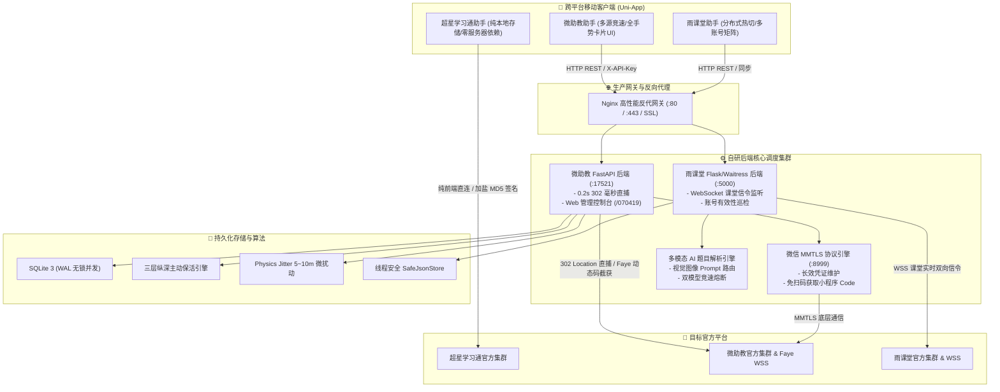

<div align="center">

# ⚡ Protocol App Reverse Suite (高校教学协议逆向与自动化工程全套开源套件)

### 基于 Uni-App 跨平台前端 + Python/Golang 高并发后端的教学协议逆向、主动保活与多模态 AI 视觉答题系统

[](https://opensource.org/licenses/MIT)
[](https://vuejs.org/)
[](https://fastapi.tiangolo.com/)
[](https://golang.org/)
[]()
[](https://www.python.org/)

<p align="center">
  <a href="#-android-安装包-apk-直接下载">📱 <b>下载 Android APK 安装包</b></a> •
  <a href="#-ai-多模态大模型配置与-api-密钥获取教程">🧠 <b>AI 密钥申请与配置</b></a> •
  <a href="#3-快速开始手把手保姆级运行教程">🚀 <b>快速开始</b></a> •
  <a href="#4-服务器永久生产部署指南linux-常驻">🖥️ <b>服务器永久部署</b></a> •
  <a href="#-常见踩坑与故障排查-faq">💡 <b>常见 FAQ</b></a>
</p>

</div>

---

> ⚠️ **免责声明（Mandatory Disclaimer）**  
> **本项目仅供网络安全攻防研究、计算机网络通信协议逆向分析与软件工程教学研究使用。**  
> 严禁将本项目用于任何非法用途、商业牟利、批量作弊或破坏学校正常教学秩序的行为。任何使用者因违规使用产生的账号封禁、系统限制或法律责任，均由使用者本人独立承担，与本项目作者及贡献者无关。

---

## 📱 Android 安装包 (APK) 直接下载

如果您不想从源码编译打包，可以直接点击下方表格中的链接**高速直链下载**已编译好的 Release 安装包：

| 应用名称 | 直接下载链接 | 安装包大小 | 核心功能亮点 | 适用系统 |
| :--- | :--- | :---: | :--- | :--- |
| **超星学习通多账号助手** | [🚀 **立即下载 (学习通签到.apk)**](https://github.com/cwywjg/Aggregate_check_in/raw/main/release/%E5%AD%A6%E4%B9%A0%E9%80%9A%E7%AD%BE%E5%88%B0.apk) | 14.98 MB | 纯本地独立运行、手机短信/密码登录、16 线程并发批量扫码、40+ 硬件指纹伪装 | Android 7.0+ |
| **雨课堂分布式答题助手** | [🚀 **立即下载 (雨课堂签到.apk)**](https://github.com/cwywjg/Aggregate_check_in/raw/main/release/%E9%9B%A8%E8%AF%BE%E5%A0%82%E7%AD%BE%E5%88%B0.apk) | 18.17 MB | WebSocket 课堂实时信令监听、多模态 AI 视觉解题、多账号批量提交、远程配置热更 | Android 7.0+ |

> 💡 **安装提示**：
> 1. 点击上方蓝字链接后，浏览器将**自动直接开始下载 APK 安装包**（无需在 GitHub 网页中二次点击）。
> 2. 下载后在 Android 手机上安装，安装时允许“未知来源应用安装”即可正常使用。

---

## 📑 目录

- [1. 项目全景架构与技术选型](#1-项目全景架构与技术选型)
- [2. 三大子系统核心特性](#2-三大子系统核心特性)
- [3. 快速开始（手把手保姆级运行教程）](#3-快速开始手把手保姆级运行教程)
  - [3.1 超星学习通快速上手（纯本地版）](#31-超星学习通快速上手纯本地版)
  - [3.2 微助教系统快速上手（全栈版）](#32-微助教系统快速上手全栈版)
  - [3.3 雨课堂系统快速上手（AI 视觉答题版）](#33-雨课堂系统快速上手ai-视觉答题版)
- [4. 🧠 AI 多模态大模型配置与 API 密钥获取教程](#4--ai-多模态大模型配置与-api-密钥获取教程)
  - [4.1 推荐渠道一：硅基流动 (SiliconFlow) - 免费快速首选](#41-推荐渠道一硅基流动-siliconflow---免费快速首选)
  - [4.2 推荐渠道二：NVIDIA Build (NIM) - 免费高精度](#42-推荐渠道二nvidia-build-nim---免费高精度)
  - [4.3 推荐渠道三：DeepSeek / OpenAI 兼容中转 / Google Gemini](#43-推荐渠道三deepseek--openai-兼容中转--google-gemini)
  - [4.4 双模型智能竞速与自动降级容灾机制](#44-双模型智能竞速与自动降级容灾机制)
  - [4.5 AI 引擎连通性与解题自测指令](#45-ai-引擎连通性与解题自测指令)
- [5. 服务器永久生产部署指南（Linux 常驻）](#5-服务器永久生产部署指南linux-常驻)
  - [5.1 Docker Compose 一键容器化部署](#51-docker-compose-一键容器化部署)
  - [5.2 Systemd 裸机守护常驻部署](#52-systemd-裸机守护常驻部署)
  - [5.3 Nginx 反向代理与 SSL 证书配置](#53-nginx-反向代理与-ssl-证书配置)
- [6. 配置文件与环境变量全量说明字典](#6-配置文件与环境变量全量说明字典)
- [7. 推荐仓库目录结构](#7-推荐仓库目录结构)
- [8. 常见踩坑与故障排查 FAQ](#8-常见踩坑与故障排查-faq)
- [9. 开源许可证与安全合规](#9-开源许可证与安全合规)

---

## 1. 项目全景架构与技术选型

本项目由前端客户端、中台调度服务、协议底座和云端 AI 推理引擎四层构成：



---

## 2. 三大子系统核心特性

### 📱 1. 超星学习通签到系统 (`学习通签到/`)
- **纯本地沙盒架构**：无需自建任何后端服务，所有账号凭证（Cookie/Token）严格保存在手机本地沙盒，零泄露风险。
- **真实设备硬件指纹伪装**：内置国内主流品牌（小米/华为/vivo/OPPO/荣耀/三星等 40+ 款旗舰机型）独立硬件参数，单机多账号具备完全物理隔离的指纹画像。
- **双鉴权登录支持**：
  - **短信验证码登录**：逆向还原移动端时间戳加盐 MD5 签名算法（`to + Salt + time`）。
  - **账号密码登录**：直接对接超星 Passport 移动端原生网关。
- **16 线程高并发打卡**：基于 Promise 任务池调度，多账号毫秒级瞬间并发提交。
- **智能打捞队列（Salvage Queue）**：针对因网络延迟未成功的账号，自动留存打捞队列，待教师大屏刷新二维码后一键对失败账号精准补签。

### ⚡ 2. 微助教签到与答题系统 (`微助教签到/`)
- **0.2 秒 302 Location 毫秒直捕**：打卡请求直接直连微助教网关，关闭自动重定向，直接在 HTTP 302 Location 头中解析打卡名次，彻底跳过网页 DOM 渲染，实现 0.15~0.25 秒极速打卡。
- **三层纵深主动保活引擎 (Keepalive Engine)**：
  - **Layer 1（YYB 凭证轮换）**：微信 Access Token 每 90 分钟自动换新（提前 30 分钟轮换），失败触发 5 分钟短退避复查。
  - **Layer 2（MMTLS 链路探测）**：开机立即实测，每 20~30 分钟随机抖动向微信端发起独立小程序 Code 申请，保持底层连接鲜活。
  - **Layer 3（微助教 Session 刷新）**：每 60 分钟巡检，Cookie 剩余有效时长 < 2 小时时自动执行 OAuth 静默换票。
- **GPS 5~10 米物理微扰动 (Physics Jitter)**：自动在基准坐标周围施加真实物理微偏差，既保证全员通过地理围栏，又彻底规避多账号同坐标风控。
- **Faye Bayeux WebSocket 动态码秒截**：挂起长轮询订阅课堂频道，教师端动态码更新瞬间 0 毫秒触发全员打卡。
- **多账号答题绝对数据隔离**：单选/多选/判断/填空/主观论述全题型支持，支持 OSS 签名图片/音频作答上传。

### 🤖 3. 雨课堂签到与多模态 AI 答题系统 (`雨课堂签到/`)
- **WebSocket 实时课堂信令监听**：全双工连接课堂 `wsapp` 频道，自动捕获开课、签到、课堂互动推题。
- **多模态大模型视觉解题路由**：
  - 自动渲染课件 PPT 截图并提取题干，组装多模态 Vision Prompt。
  - 支持 SiliconFlow（Qwen2.5-VL）、NVIDIA（Gemma-4/Nemotron）、DeepSeek、OpenAI、Gemini 等主流大模型。
  - 内置 **Thinking 深度思考竞速 -> 25s 熔断回退 Fast 通道** 的双模型容灾机制。
- **分布式配置热切换**：支持通过 GitCode / 自建 Raw 镜像动态更新服务器 IP，客户端无需重新打包即可无感切换。

---

## 3. 快速开始（手把手保姆级运行教程）

### 3.1 超星学习通快速上手（纯本地版）

#### 方式一：运行 Python 交互式登录提取工具
无需安装任何第三方库（仅使用 Python 原生内置模块）：

```bash
# 1. 进入学习通目录
cd 学习通签到

# 2. 启动交互式客户端
python xxt_login.py
```

**运行交互流程：**
```
=====================================================
          超星学习通 移动端登录交互终端
=====================================================
  [1] 手机号 + 短信验证码登录
  [2] 手机号 / 账号 + 密码登录
  [0] 退出
=====================================================
请选择登录模式 [1/2/0]: 1
请输入手机号: 13800138000
[*] 正在向手机号 13800138000 发送验证码...
[+] 短信验证码发送成功！请注意查收手机短信。
请输入收到的 4-6 位短信验证码: 123456
[*] 正在提交登录验证 (短信验证码)...
[+] Passport 账号验证成功！
[+] 提取核心 UID: 100000001
[*] 正在同步用户信息与机构绑定...
=============================================
            【登录成功 - 用户信息】
  用户姓名: 张三
  所属学校: 天津商业大学
  学号/工号: 20260001
  用户 UID: 100000002 (puid: 100000001)
  绑定手机: 13800138000
=============================================
[+] 登录凭证已成功保存至: chaoxing_cookies.json
```

#### 方式二：使用 HBuilderX 运行 Uni-App 移动端 App
1. 下载并安装 [HBuilderX](https://www.dcloud.io/hbuilderx.html)（官方正式版）。
2. 在 HBuilderX 顶部菜单选择：`文件` -> `打开目录` -> 选择 `学习通签到` 文件夹。
3. 运行项目：
   - **浏览器运行**：点击顶部菜单 `运行` -> `运行到浏览器` -> `Chrome`。
   - **手机/真机运行**：使用 USB 数据线连接 Android 手机（开启 USB 调试模式），点击 `运行` -> `运行到 Android App 基座`。
4. **App 界面操作**：
   - 点击 **“添加新账号凭证”**，输入备注名、手机号即可直接验证码或密码登录。
   - 教师出示签到二维码后，点击右上角 **“批量扫码签到”**，16 并发极速打卡。

---

### 3.2 微助教系统快速上手（全栈版）

微助教系统包含 **Go 微信底层引擎**、**Python FastAPI 调度后端** 和 **Uni-App 客户端**。

#### 第一步：启动 yyb-go 微信底协议引擎
```bash
cd 微助教签到/yyb_go

# Windows 直接运行预编译程序：
.\yyb-go.exe -port 8999

# Linux / macOS 运行：
chmod +x ./yyb-go
./yyb-go -port 8999
```
* 服务启动后监听在 `http://127.0.0.1:8999`。

#### 第二步：配置并启动 Python FastAPI 后端服务
打开新的终端窗口：

```bash
cd 微助教签到/server

# 1. 创建 Python 独立虚拟环境并激活
python -m venv venv
# Windows 激活命令：
.\venv\Scripts\activate
# Linux/macOS 激活命令：
source venv/bin/activate

# 2. 安装项目依赖
pip install -r requirements.txt

# 3. 复制环境变量配置文件
copy .env.example .env   # Linux: cp .env.example .env

# 4. 启动 FastAPI 后端服务
uvicorn main:app --host 0.0.0.0 --port 17521 --reload
```

#### 第三步：访问 Web 管理控制台添加账号
1. 打开浏览器访问安全入口：`http://127.0.0.1:17521/070419`
2. 点击 **“添加微信账号”**，使用微信扫描网页生成的二维码。
3. 扫码确认后，系统自动提取 Token、初始化三层保活引擎，并将账号存入 SQLite 数据库。

#### 第四步：运行微助教 Uni-App 移动客户端
1. 在 HBuilderX 中打开 `微助教签到/app` 目录。
2. 在 `app/pages/login/index.vue` 或 App 设置页面中，填入您的后端服务器地址（本地调试填 `http://127.0.0.1:17521`）与 API Key。
3. 点击 `运行` -> `运行到内置浏览器` 或 `运行到 Android App 基座` 即可体验全套极速打卡与答题功能。

---

### 3.3 雨课堂系统快速上手（AI 视觉答题版）

#### 第一步：配置并启动雨课堂后端与 AI 解题服务
```bash
cd 雨课堂签到

# 1. 创建并激活虚拟环境
python -m venv venv
.\venv\Scripts\activate  # Linux: source venv/bin/activate

# 2. 安装所需依赖
pip install -r requirements.txt

# 3. 复制环境配置文件
copy .env.example .env   # Linux: cp .env.example .env
```

编辑 `.env` 文件，填入您的大模型 API 密钥（获取方法请参考下方 [第 4 节 AI 密钥获取教程](#4--ai-多模态大模型配置与-api-密钥获取教程)）：
```ini
PORT=5000

# 推荐选用国内极速免费大模型 (SiliconFlow 硅基流动)
AI_PROVIDER=siliconflow
AI_API_KEY=sk-your-siliconflow-api-key-here
AI_BASE_URL=https://api.siliconflow.cn/v1
AI_MODELS=Qwen/Qwen2.5-VL-72B-Instruct
SILICONFLOW_IMAGE_DETAIL=low
```

启动主服务：
```bash
python api_server.py
```
* 后台将在 `http://0.0.0.0:5000` 启动，自动加载 AI 视觉解题路由与 WebSocket 监控引擎。

#### 第二步：运行雨课堂 Uni-App 客户端
1. 在 HBuilderX 中打开 `雨课堂签到` 目录。
2. 确认 `server_config.json` 中的 `server_url` 指向 `http://127.0.0.1:5000`。
3. 点击 `运行` -> `运行到内置浏览器` 或 `运行到 Android 基座`。
4. 在 App 账号列表导入雨课堂 Cookie（格式：`sessionid=xxx; sid=yyy;`），开启课堂自动化监控。

---

## 4. 🧠 AI 多模态大模型配置与 API 密钥获取教程

雨课堂智能答题引擎采用**多模态大模型（Vision LLM）**技术，能够自动识别课件中的数学公式、函数图像、多选题选项及复杂排版。以下为您提供各大主流模型平台的 **API 密钥免费申请与配置指南**：

```
[课件 PPT / 手机截屏] ──► [提取高清图+题干] ──► [组装 Vision Prompt] ──► [调用 AI API] ──► [毫秒级解析出 JSON 答案]
```

### 4.1 推荐渠道一：硅基流动 (SiliconFlow) - 免费快速首选 ⭐️

> **优势**：国内直连超低延迟（0.8~1.5秒），新用户注册即赠送免费额度，官方原生支持顶级开源视觉大模型 `Qwen/Qwen2.5-VL-72B-Instruct`。

1. **注册与创建密钥**：
   - 打开官网注册：👉 **[https://cloud.siliconflow.cn/](https://cloud.siliconflow.cn/)**
   - 进入控制台 -> 点击左侧菜单 **“API 密钥”** -> 点击 **“新建 API 密钥”**。
   - 复制生成的密钥字符串（以 `sk-` 开头）。
2. **在 `雨课堂签到/.env` 中配置**：
   ```ini
   AI_PROVIDER=siliconflow
   AI_API_KEY=sk-xxxxxxxxxxxxxxxxxxxxxxxxxxxxxxxx
   AI_BASE_URL=https://api.siliconflow.cn/v1
   AI_MODELS=Qwen/Qwen2.5-VL-72B-Instruct
   SILICONFLOW_IMAGE_DETAIL=low
   ```

---

### 4.2 推荐渠道二：NVIDIA Build (NIM) - 免费高精度

> **优势**：NVIDIA 官方提供 1000 次免费 API 调用积分，支持 Google Gemma-4、Meta Llama-3.2-Vision 等顶尖工业级模型。

1. **注册与创建密钥**：
   - 打开官网：👉 **[https://build.nvidia.com/](https://build.nvidia.com/)**
   - 使用邮箱注册并登录 -> 在模型列表中搜索 `google/gemma-4-31b-it` 或 `meta/llama-3.2-90b-vision-instruct`。
   - 点击 **“Get API Key”** -> 复制生成的密钥（以 `nvapi-` 开头）。
2. **在 `雨课堂签到/.env` 中配置**：
   ```ini
   AI_PROVIDER=nvidia
   AI_API_KEY=nvapi-xxxxxxxxxxxxxxxxxxxxxxxxxxxxxx
   AI_BASE_URL=https://integrate.api.nvidia.com/v1
   AI_MODELS=google/gemma-4-31b-it
   ```

---

### 4.3 推荐渠道三：DeepSeek / OpenAI 兼容中转 / Google Gemini

如果您拥有其他平台的 API 密钥，可直接使用标准兼容模式配置：

#### ① DeepSeek 官方配置
```ini
AI_PROVIDER=compatible
AI_API_KEY=sk-your-deepseek-key
AI_BASE_URL=https://api.deepseek.com/v1
AI_MODELS=deepseek-chat
```

#### ② Google Gemini 官方配置
```ini
AI_PROVIDER=gemini
AI_API_KEY=AIzaSyxxxxxxxxxxxxxxxxxxxxxxxxxxxx
AI_MODELS=gemini-2.0-flash,gemini-2.5-flash
```

---

### 4.4 双模型智能竞速与自动降级容灾机制

为防止课堂答题因单个大模型网络卡顿而错过教师提交截止时间，后台内置了**双模型双通道自动熔断调度算法**：

```
                    ┌────────────────────────┐
                    │ 收到课堂推题信令与截屏 │
                    └───────────┬────────────┘
                                │
                 ┌──────────────┴──────────────┐
                 ▼                             ▼
        【主通道: 深度思考模型】        【备用通道: Fast 极速模型】
      Qwen2.5-VL-72B (Thinking)            Qwen2.5-VL-7B (Fast)
                 │                             │
         （限时 25 秒竞速）             （主通道超过 25s 自动接管）
                 │                             │
                 └──────────────┬──────────────┘
                                ▼
                    ┌────────────────────────┐
                    │ 0.1s 提取标准 JSON 答案 │
                    │ 触发多账号并发打卡提交 │
                    └────────────────────────┘
```

* **配置控制参数**：
  ```ini
  AI_ENABLE_THINKING=1        # 开启深度思考模型优先
  AI_THINKING_TIMEOUT=25      # 深度思考超时阈值设为 25 秒
  AI_ROUTE_CYCLES=2           # 失败自动交替重试 2 轮
  ```

---

### 4.5 AI 引擎连通性与解题自测指令

配置好 `.env` 密钥后，可以在终端运行以下指令一键验证连通性：

```bash
# 1. 启动服务后调用健康检查接口
curl -s http://127.0.0.1:5000/api/ai/health

# 预期返回包含大模型延迟与健康状态：
# {"code":0,"data":{"status":"ok","models":["Qwen/Qwen2.5-VL-72B-Instruct"],"latency_ms":1250}}

# 2. 运行内置全真解题单测
cd 雨课堂签到
python test_ai_real.py
```

---

## 5. 服务器永久生产部署指南（Linux 常驻）

> 📖 **更详细的逐步运维指令与排错方案请参阅 [docs/server_deploy.md](file:///d:/app/%E9%80%86%E5%90%91%E5%85%A5%E9%97%A8%E6%95%99%E5%AD%A6/docs/server_deploy.md)**

### 5.1 Docker Compose 一键容器化部署

在 Linux 服务器（Ubuntu 20.04/22.04/24.04）上推荐使用 Docker Compose 统一编排：

```bash
# 1. 安装 Docker 与 Docker Compose
sudo apt update && sudo apt install -y docker-ce docker-compose-plugin

# 2. 在项目根目录启动全套服务
docker compose up -d

# 3. 查看容器健康状态
docker compose ps
```

### 5.2 Systemd 裸机守护常驻部署

使用 Linux 原生 Systemd 管理进程，确保开机自启、崩溃自动秒级拉起：

```bash
# 1. 创建微助教 Systemd 服务 (/etc/systemd/system/wzj-api.service)
sudo nano /etc/systemd/system/wzj-api.service
```
```ini
[Unit]
Description=TeacherMate Protocol Backend API
After=network.target

[Service]
Type=simple
User=root
WorkingDirectory=/home/ubuntu/projects/微助教签到/server
EnvironmentFile=/home/ubuntu/projects/微助教签到/server/.env
ExecStart=/home/ubuntu/projects/微助教签到/server/venv/bin/uvicorn main:app --host 0.0.0.0 --port 17521 --workers 2
Restart=always
RestartSec=5s
LimitNOFILE=65535

[Install]
WantedBy=multi-user.target
```

激活并启动服务：
```bash
sudo systemctl daemon-reload
sudo systemctl enable --now wzj-api
sudo systemctl status wzj-api --no-pager
```

### 5.3 Nginx 反向代理与 SSL 证书配置

配置 Nginx 支持 50MB 图片上传、WebSocket 协议升级与 HTTPS 加密：

```nginx
server {
    listen 80;
    server_name api.yourdomain.com; # 替换为您的域名

    client_max_body_size 50M;

    location / {
        proxy_pass http://127.0.0.1:17521;
        proxy_set_header Host $host;
        proxy_set_header X-Real-IP $remote_addr;
        proxy_set_header X-Forwarded-For $proxy_add_x_forwarded_for;
        proxy_set_header X-Forwarded-Proto $scheme;

        # WebSocket 协议升级支持
        proxy_http_version 1.1;
        proxy_set_header Upgrade $http_upgrade;
        proxy_set_header Connection "upgrade";
    }
}
```

申请免费 Let's Encrypt 证书：
```bash
sudo certbot --nginx -d api.yourdomain.com --non-interactive --agree-tos -m your-email@example.com --redirect
```

---

## 6. 配置文件与环境变量全量说明字典

### 微助教后端环境变量 (`微助教签到/server/.env`)
| 变量名 | 默认值 | 必填 | 作用与示例 |
| :--- | :--- | :---: | :--- |
| `PORT` | `17521` | 否 | FastAPI 后端服务监听端口 |
| `API_KEY` | `your-secure-api-key-here` | 是 | 接口访问鉴权密码（客户端请求需携带此 `X-API-Key`） |
| `YYB_GO_URL`| `http://127.0.0.1:8999` | 是 | yyb-go 微信底协议引擎通信地址 |
| `DB_PATH` | `server/data.db` | 否 | SQLite 数据库存储绝对路径 |

### 雨课堂后端环境变量 (`雨课堂签到/.env`)
| 变量名 | 默认值 | 必填 | 作用与示例 |
| :--- | :--- | :---: | :--- |
| `PORT` | `5000` | 否 | Flask 后端服务监听端口 |
| `AI_PROVIDER` | `siliconflow` | 是 | 大模型平台选型 (`siliconflow` / `nvidia` / `deepseek` / `gemini` / `openai`) |
| `AI_API_KEY` | `sk-xxxxxx` | 是 | 大模型平台提供的 API Key |
| `AI_MODELS` | `Qwen/Qwen2.5-VL-72B-Instruct` | 是 | 视觉大模型名称 |
| `SILICONFLOW_IMAGE_DETAIL`| `low` | 否 | 图像解析模式：`low` (极速 1s 响应) / `high` (高清模式) |
| `YKT_ADMIN_KEY` | `your_admin_key` | 否 | 管理员控制台口令 |

---

## 7. 推荐仓库目录结构

```
protocol-app-suite/
├── .gitignore                         # 完整多技术栈 Git 忽略规则
├── LICENSE                            # MIT 开源许可证
├── README.md                          # 🌟 项目全景主文档
├── docker-compose.yml                 # 生产级 Docker 编排配置
│
├── release/                           # 📱 编译好的 Release 安装包
│   ├── 学习通签到.apk                  # 超星学习通多账号助手 Android 安装包 (14.98 MB)
│   └── 雨课堂签到.apk                  # 雨课堂分布式 AI 助手 Android 安装包 (18.17 MB)
│
├── docs/                              # 📚 深度文档中心
│   ├── server_deploy.md               # Linux 服务器永久生产部署实战手册
│   ├── protocol_flow.md               # 网络协议深度交互时序与报文规范
│   └── faq.md                         # 常见踩坑与故障排查 FAQ
│
├── 学习通签到/                         # 📱 超星学习通多账号助手 (纯本地独立运行)
│   ├── pages/index/index.vue          # 前端主页面 (Apple 质感 UI / 16 并发批量扫码 / 精准打捞 / 硬件指纹)
│   ├── xxt_login.py                   # Python 协议登录、MD5 加盐签名与 Cookie 提取工具
│   ├── chaoxing_cookies.example.json  # 凭证存储结构模板
│   ├── manifest.json                  # App 打包与权限配置
│   ├── pages.json                     # 页面路由定义
│   ├── App.vue                        # 应用生命周期
│   └── main.js                        # Uni-App 入口
│
├── 微助教签到/                         # ⚡ 微助教自动化系统 (0.2s 直捕 / 三层保活 / 全题型答题)
│   ├── app/                           # Uni-App 移动客户端源码
│   │   ├── api/request.js             # 多源竞速动态配置拉取与 API 拦截器
│   │   ├── pages/                     # 首页、扫码、答题详情、设置页面
│   │   └── store/index.js             # Vuex 状态管理与自动巡检
│   ├── server/                        # FastAPI 调度后端
│   │   ├── main.py                    # 入口服务、Web 控制台路由 (/070419)
│   │   ├── config.py                  # 环境变量与配置管理
│   │   ├── auth.py                    # X-API-Key 鉴权中间件
│   │   ├── .env.example               # 生产环境配置模板
│   │   ├── models/database.py         # SQLite 异步数据持久化与自动建表
│   │   ├── routers/                   # 业务路由 (accounts / signin / quiz / upload)
│   │   ├── services/                  # 核心服务 (teachermate / keepalive / yyb_service)
│   │   └── static/index.html          # Web 管理控制台 SPA 页面
│   └── yyb_go/                        # 微信 MMTLS 协议底层引擎模块
│
└── 雨课堂签到/                         # 🤖 雨课堂分布式系统 (WS 课堂监听 / 多模态 AI 解题)
    ├── pages/                         # Uni-App 移动客户端源码
    ├── api_server.py                  # 后台 API 服务与多租户同步网关
    ├── ai_solver.py                   # 多模态 AI 大模型视觉题目解析引擎
    ├── ykt_ws_engine.py               # WebSocket 实时课堂信令监听器
    ├── ykt_monitor.py                 # 全自动巡检与保活调度
    ├── safe_json_store.py             # 线程安全 JSON 存储引擎
    ├── server_config.example.json     # 分布式服务器动态配置示例
    ├── accounts.example.json          # 多账号凭证结构示例
    ├── .env.example                   # 环境变量配置模板
    └── deploy/                        # PM2 / Systemd 一键部署脚本包
```

---

## 8. 常见踩坑与故障排查 FAQ

> 💡 **完整 20+ 场景排障请参阅 [docs/faq.md](file:///d:/app/%E9%80%86%E5%90%91%E5%85%A5%E9%97%A8%E6%95%99%E5%AD%A6/docs/faq.md)**

| 现象 / 报错 | 常见根因 | 极速解决方法 |
| :--- | :--- | :--- |
| **微助教 403 Forbidden** | 客户端 `X-API-Key` 与后端 `.env` 不一致 | 检查后端 `.env` 中的 `API_KEY`，在 App 设置页重新填入完全相同的密钥。 |
| **学习通短信签名失败** | 时间戳使用了秒级（10位） | 必须使用 13 位毫秒时间戳计算 `md5(phone + Salt + timestamp)`。 |
| **微助教提示账号过期** | 微信底层凭证过期或保活未运行 | 访问 `http://<IP>:17521/070419` 重新扫码登录，确认后台三层保活引擎正在运行。 |
| **端口已被占用** | 旧进程未杀干净 | 执行 `sudo lsof -i :17521` 找到 PID，执行 `kill -9 <PID>` 强制释放端口。 |
| **AI 答题超时 (45s)** | 国外模型网络波动或 API 余额不足 | 切换为国内 SiliconFlow 平台的 `Qwen/Qwen2.5-VL-72B-Instruct` 极速模型。 |

---

## 9. 开源许可证与安全合规

本项目采用 **[MIT License](file:///d:/app/%E9%80%86%E5%90%91%E5%85%A5%E9%97%A8%E6%95%99%E5%AD%A6/LICENSE)** 开源许可证。

- **允许**：自由修改、技术研究、分发、个人学习与二次开发。
- **限制**：二次分发必须保留原作者版权信息与本项目的免责声明；严禁用于任何破坏计算机信息系统与扰乱高校教学管理的行为。
