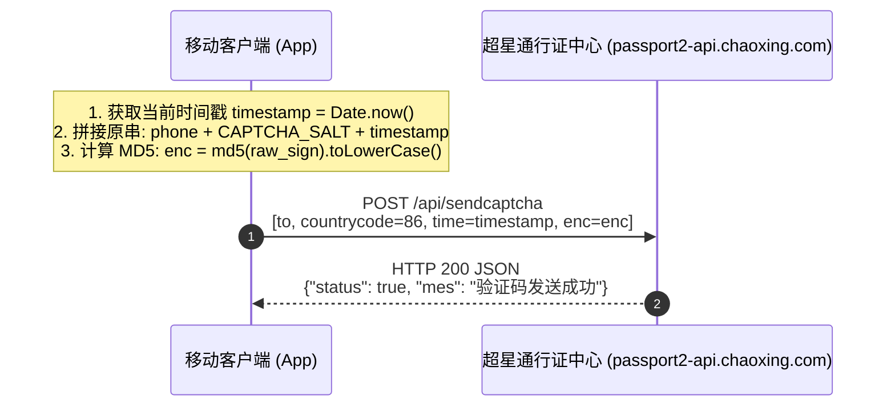
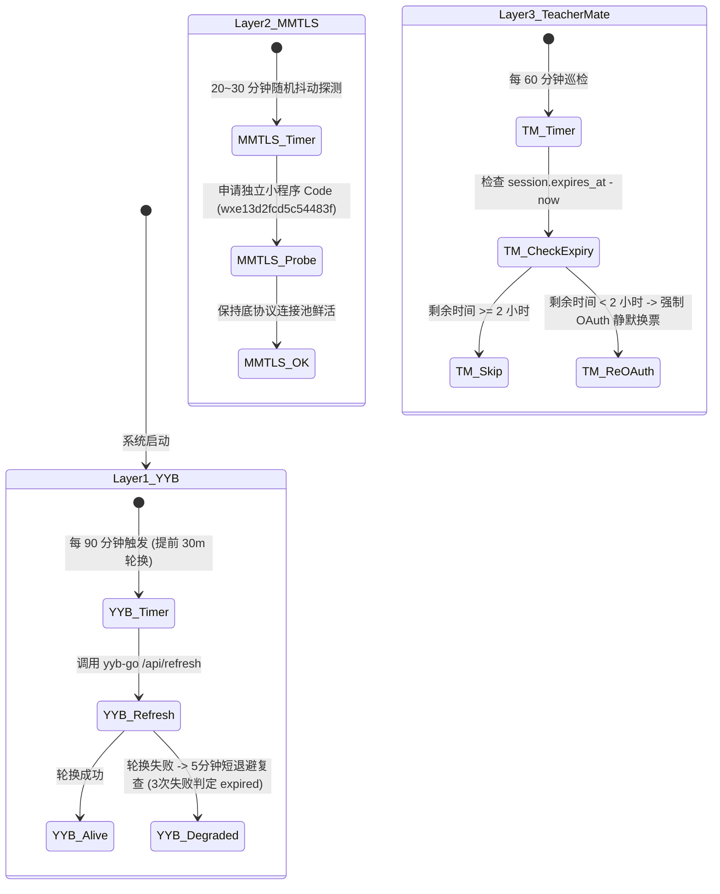
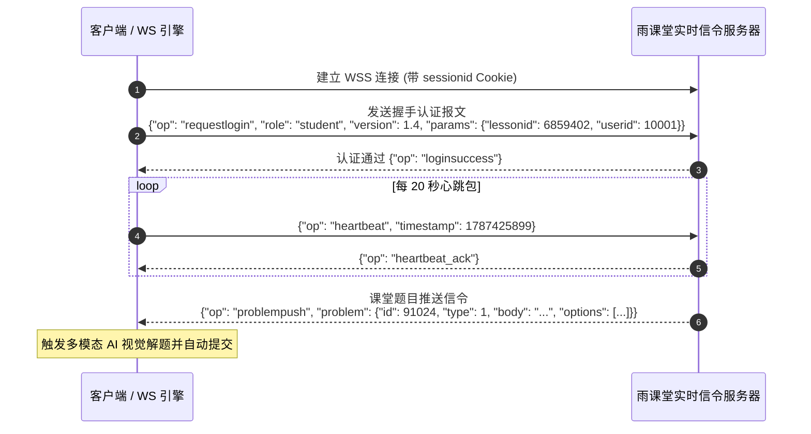

# 网络协议深度交互时序与报文接口规范 (Protocol Flow Specification)

> **文档版本**：v3.0.0-Enterprise  
> **覆盖系统**：超星学习通 (ChaoXing) + 微助教 (TeacherMate) + 雨课堂 (YuKeTang)  
> **核心涵盖**：网络请求完整时序、鉴权 Token 换取、签名生成算法、三层主动保活引擎、WebSocket/Faye 实时信令、报文载荷结构与状态码字典。

---

## 目录
- [1. 超星学习通 (ChaoXing) 核心网络协议分析](#1-超星学习通-chaoxing-核心网络协议分析)
  - [1.1 短信验证码 MD5 签名生成算法](#11-短信验证码-md5-签名生成算法)
  - [1.2 Passport 移动端鉴权登录时序](#12-passport-移动端鉴权登录时序)
  - [1.3 SSO 用户画像与高校机构绑定同步](#13-sso-用户画像与高校机构绑定同步)
  - [1.4 MobileLearn 二维码极速签到协议报文](#14-mobilelearn-二维码极速签到协议报文)
- [2. 微助教 (TeacherMate) 核心网络协议分析](#2-微助教-teachermate-核心网络协议分析)
  - [2.1 微信小程序 Code 到 OAuth Session 换票时序](#21-微信小程序-code-到-oauth-session-换票时序)
  - [2.2 三层纵深主动保活引擎 (Keepalive Engine)](#22-三层纵深主动保活引擎-keepalive-engine)
  - [2.3 扫码签到 0.2 秒 302 Location 毫秒直捕协议](#23-扫码签到-02-秒-302-location-毫秒直捕协议)
  - [2.4 Faye/Bayeux WebSocket 动态二维码实时截获](#24-fayebayeux-websocket-动态二维码实时截获)
  - [2.5 GPS 5~10 米物理微扰动（Physics Jitter）防风控算法](#25-gps-510-米物理微扰动physics-jitter防风控算法)
  - [2.6 全题型作答 JSON 载荷与 OSS 签名协议](#26-全题型作答-json-载荷与-oss-签名协议)
- [3. 雨课堂 (YuKeTang) 核心网络协议分析](#3-雨课堂-yuketang-核心网络协议分析)
  - [3.1 设备指纹与 Session Cookie 组装](#31-设备指纹与-session-cookie-组装)
  - [3.2 WebSocket 实时课堂信令监听与心跳保活](#32-websocket-实时课堂信令监听与心跳保活)
  - [3.3 多模态 AI 视觉解题与格式化提交闭环](#33-多模态-ai-视觉解题与格式化提交闭环)
- [4. 全系统错误码字典与会话状态机](#4-全系统错误码字典与会话状态机)

---

## 1. 超星学习通 (ChaoXing) 核心网络协议分析

### 1.1 短信验证码 MD5 签名生成算法

学习通移动端发送短信验证码时，客户端通过对手机号、专用 Salt 盐和当前毫秒时间戳进行 MD5 摘要计算生成 `enc` 签名。



#### 签名算法公式：
$$\text{enc} = \text{MD5}(\text{phone} + \text{CAPTCHA\_SALT} + \text{timestamp})$$

* `phone`：11 位手机号码（如 `13800138000`）
* `CAPTCHA_SALT`：`jsDyctOCnay7uotq`（写死在 Android 原生 dex/so 中的静态密钥）
* `timestamp`：13 位 Unix 毫秒时间戳（如 `1787425899144`）

---

### 1.2 Passport 移动端鉴权登录时序

```http
POST /v11/loginregister?cx_xxt_passport=json HTTP/1.1
Host: passport2-api.chaoxing.com
User-Agent: Dalvik/2.1.0 (Linux; U; Android 13; Pixel 4) com.chaoxing.mobile/ChaoXingStudy_3_7.0.0
Content-Type: application/x-www-form-urlencoded

uname=13800138000&code=123456&loginType=2&countrycode=86&roleSelect=true
```

#### 请求参数定义：
| 参数名 | 类型 | 是否必选 | 说明 |
| :--- | :--- | :--- | :--- |
| `uname` | String | 是 | 手机号 / 学号 / 账号 |
| `code` | String | 是 | 4~6 位短信验证码 或 登录密码 |
| `loginType` | String | 是 | 鉴权模式：`"2"` 为验证码快捷登录，`"1"` 为密码登录 |
| `countrycode`| String | 是 | 国际区号（默认 `"86"`） |
| `roleSelect` | String | 是 | 固定值 `"true"`，允许返回组织角色 |

#### 成功响应报文：
```json
{
  "status": true,
  "msg2": "登录成功",
  "url": "https://sso.chaoxing.com/apis/login/userLogin4Uname.do?_from=passport"
}
```
> **注**：此时响应头中的 `Set-Cookie` 将下发包含 `UID`, `_uid`, `cx_p_token`, `p_auth_token`, `vc3`, `uf` 的核心身份凭证集合。

---

### 1.3 SSO 用户画像与高校机构绑定同步

```http
POST /apis/login/userLogin4Uname.do?_from=passport HTTP/1.1
Host: sso.chaoxing.com
Cookie: UID=100000001; _uid=100000001; vc3=...; uf=...
Content-Type: application/x-www-form-urlencoded
```

#### 返回报文解析（用于提取高校绑定与真实姓名）：
```json
{
  "result": 1,
  "msg": {
    "uid": 100000002,
    "puid": 100000001,
    "name": "张三",
    "nick": "张三",
    "schoolname": "天津商业大学",
    "uname": "20260001",
    "phone": "13800138000",
    "fid": 1001,
    "dxfid": "866"
  }
}
```

---

### 1.4 MobileLearn 二维码极速签到协议报文

客户端扫码识别到二维码内容（例如包含 `id=12345678` 与 `enc=ABCDEF0123456789`）后，直接向学习空间核心打卡接口发起 HTTP GET 请求：

```http
GET /widget/sign/e?id=12345678&c=&enc=ABCDEF0123456789&DB_STRATEGY=PRIMARY_KEY&STRATEGY_PARA=id HTTP/1.1
Host: mobilelearn.chaoxing.com
User-Agent: Dalvik/2.1.0 (Linux; U; Android 13; Pixel 4) com.chaoxing.mobile/ChaoXingStudy_3_7.0.0
Cookie: UID=100000001; _uid=100000001; vc3=...; uf=...
Upgrade-Insecure-Requests: 1
```

#### 核心 URL 字段解析：
* `id`：签到活动主键 ID（activePrimaryId）。
* `c`：签到活动流水防重标识 Code。
* `enc`：教师端动态刷新生成的 32 位 MD5 签到验证签名串。
* `DB_STRATEGY=PRIMARY_KEY&STRATEGY_PARA=id`：超星分布式数据库路由参数。

#### 结果解析规则（HTML DOM / Keyword 匹配）：
1. **签到成功**：响应内容包含 `zsign_success`、`签到成功` 或 `已成功签到`。
2. **已签过**：响应内容包含 `您已签到过了`、`已签到`。
3. **已截止**：包含 `已过老师设置的截止时间`、`下次早点来`。
4. **GPS受限**：包含 `请在指定范围内签到`、`不在签到范围`。
5. **二维码失效**：包含 `二维码已失效`、`二维码过期`（触发客户端精准打捞队列）。

---

## 2. 微助教 (TeacherMate) 核心网络协议分析

### 2.1 微信小程序 Code 到 OAuth Session 换票时序

微助教采用基于微信 OAuth2 的三步鉴权换票机制：

```mermaid
sequenceDiagram
    autonumber
    participant App as 客户端 / 调度后台
    participant YYB as yyb-go 微信底协议引擎 (:8999)
    participant WZJ as 微助教 OAuth 网关 (v18.teachermate.cn)

    App->>YYB: POST /api/get_code<br/>{"ref": openid, "appid": "wxa153455f3ef1d9f9"}
    YYB-->>App: HTTP 200 {"code": "081abcdef..."}

    App->>WZJ: GET /api/v1/wechat/r?m=s_answer&code=081abcdef...&state=
    Note over WZJ: 关闭自动重定向 (follow_redirects=False)
    WZJ-->>App: HTTP 302 Found<br/>Location: /wechat-api/v3/students?openid=USER_OPENID
    
    App->>WZJ: GET /wechat-api/v3/students?openid=USER_OPENID
    WZJ-->>App: HTTP 200 OK<br/>Set-Cookie: session=s%3Axxxx; session.sig=yyyy; grayVersion=0
```

---

### 2.2 三层纵深主动保活引擎 (Keepalive Engine)

为彻底解决微信长效登录态掉线与微助教 Cookie 24小时过期的行业痛点，系统架构了三层独立巡检的主动保活机制：



---

### 2.3 扫码签到 0.2 秒 302 Location 毫秒直捕协议

传统方式加载完整 SPA 页面耗时 2~3 秒。本系统直接在 HTTP 302 阶段秒级捕获 Header，杜绝下载 HTML/JS 资源：

```http
GET /api/v1/wechat/r?isTeacher=0&m=s_qr_sign&extra=f40b473087237423563cbd61a6e50162&code=081a...&state= HTTP/1.1
Host: www.teachermate.com.cn
User-Agent: Mozilla/5.0 (Linux; Android 10; Mobile) MicroMessenger/8.0.40
```

#### 服务端立即响应 302 重定向头：
```http
HTTP/1.1 302 Found
Location: https://www.teachermate.com.cn/signresult?success=1&studentRank=1&rank=1
```
> **直捕逻辑**：Python 后端通过正则解析 `Location` 头中的 `studentRank=1` 与 `success=1`，耗时仅 **0.15~0.25 秒**。

---

### 2.4 Faye/Bayeux WebSocket 动态二维码实时截获

针对课堂上 3~5 秒一刷新的动态二维码，后台直连微助教 CometD/Faye 长轮询通道：

1. **Handshake 握手**：
   ```json
   [{"channel": "/meta/handshake", "version": "1.0", "supportedConnectionTypes": ["long-polling"], "id": "1"}]
   ```
2. **Subscribe 订阅课程签到通道**：
   ```json
   [{"channel": "/meta/subscribe", "clientId": "client_xyz", "subscription": "/attendance/10086/9001/qr", "id": "2"}]
   ```
3. **Connect 长轮询监听动态事件**：
   当教师端屏幕切换时，服务器下发：
   ```json
   [{"channel": "/attendance/10086/9001/qr", "data": {"qrUrl": "https://www.teachermate.com.cn/api/v1/wechat/qr/a1b2c3d4e5f6..."}, "id": "3"}]
   ```
   **响应动作**：后台立即提取 `extra=a1b2c3d4e5f6...`，0 毫秒延迟调度所有账号并发打卡。

---

### 2.5 GPS 5~10 米物理微扰动（Physics Jitter）防风控算法

多账号在同一毫秒以完全相同的经纬度提交打卡会被微助教安全引擎风控识别。系统在基准坐标周围施加随机方向的物理微偏差：

$$\Delta \text{deg} = \frac{\text{Uniform}(5.0, 10.0)}{111000.0} \times \text{Choice}(\{-1, 1\})$$
$$\text{Lat}_{\text{final}} = \text{Lat}_{\text{base}} + \Delta \text{deg}, \quad \text{Lon}_{\text{final}} = \text{Lon}_{\text{base}} + \Delta \text{deg}$$

* 偏差距离：严格锁定在 **5~10 米** 范围内，绝对不超出教师设定的地理围栏（通常为 100~500 米）。
* 独立性：每个账号打卡坐标均完全独立，形成真实的人群物理散布。

---

### 2.6 全题型作答 JSON 载荷与 OSS 签名协议

```http
POST /wechat-api/v3/students/answer/question HTTP/1.1
Host: v18.teachermate.cn
openId: USER_OPENID
Cookie: session=...; session.sig=...
Content-Type: application/json

{
  "courseId": 10086,
  "questionId": 90124,
  "answer": [{"index": 0}, {"index": 2}],
  "files": ["https://oss.teachermate.cn/upload/student_img_01.png"],
  "audio": []
}
```

#### 题型与 `answer` 字段规范：
* **单选/多选/判断题 (type 1/2/3)**：必须为字典对象数组 `[{"index": 0}, {"index": 1}]`，直接传整数数组将触发服务端类型转换异常。
* **填空题 (type 4)**：字符串数组 `["第一空答案", "第二空答案"]`。
* **主观题 (type 5)**：纯字符串 `"本题论述内容如下..."`。

---

## 3. 雨课堂 (YuKeTang) 核心网络协议分析

### 3.1 设备指纹与 Session Cookie 组装

雨课堂 API 请求头中需携带模拟真实移动端指纹的 `xtua`、`x-client` 及 `sessionid`：

```http
POST /api/v3/lesson/checkin HTTP/1.1
Host: changjiang.yuketang.cn
User-Agent: Android
xtua: client=app&tag=1.3.3&platform=Android
xtbz: ykt
x-client: app
Cookie: sessionid=abcdef1234567890; sid=02ad97e1ad5ea61486556c814d31aa3f; django_language=zh-cn;
Content-Type: application/json

{
  "lesson_id": 6859402,
  "source": 1
}
```

---

### 3.2 WebSocket 实时课堂信令监听与心跳保活

雨课堂在线课堂通过全双工 WebSocket 连接通信：
* 端点地址：`wss://changjiang.yuketang.cn/wsapp/`



---

### 3.3 多模态 AI 视觉解题与格式化提交闭环

```
[WebSocket 捕获题目] ──► [提取题干文字 + 渲染 PPT 截图] ──► [组装多模态 Prompt] ──► [SiliconFlow/NVIDIA 大模型] ──► [提取严格 JSON 答案] ──► [调用 API 并发提交]
```

1. **多模态大模型 Prompt 输入示例**：
   ```json
   {
     "model": "Qwen/Qwen2.5-VL-72B-Instruct",
     "messages": [
       {
         "role": "user",
         "content": [
           {"type": "text", "text": "你是一名大学专业课金牌助教。请仔细阅读题目与配图，给出唯一正确答案选项。输出格式必须为合法 JSON: {\"answer\": [\"A\"]}"},
           {"type": "image_url", "image_url": {"url": "data:image/jpeg;base64,/9j/4AAQSkZJRg..."}}
         ]
       }
     ]
   }
   ```
2. **AI 解析输出规范**：
   ```json
   {"answer": ["A", "C"]}
   ```
3. **提交答题 API 报文**：
   ```http
   POST /api/v3/lesson/problem/answer HTTP/1.1
   Host: changjiang.yuketang.cn
   Cookie: sessionid=...; sid=...

   {"lesson_id": 6859402, "problem_id": 91024, "result": ["A", "C"]}
   ```

---

## 4. 全系统错误码字典与会话状态机

| 状态码 / 标识 | 所属系统 | 协议含义 | 客户端自愈与处理动作 |
| :--- | :--- | :--- | :--- |
| `HTTP 302 (Location 到 open.weixin.qq.com)` | 微助教 | 微信小程序 Code 已过期或被重复消费 | 立即调用 yyb-go 获取全新 Code，现场 0 延迟重试打卡。 |
| `HTTP 401 / 403 (Forbidden)` | 通用 | API Key 不匹配或 Session 失效 | 触发 OAuth 自动重新换票流程，更新本地存储。 |
| `database is locked` | 后端 SQLite | 高并发写冲突 | 自动启用 WAL 日志模式并配置 5 秒 Busy Timeout。 |
| `不在签到范围` | 学习通/微助教 | 地理围栏超出判定 | 提示 GPS 围栏限制，检查坐标扰动基准点是否准确。 |
| `二维码已过期 / 二维码已失效` | 学习通/微助教 | 教师端刷新了二维码 | 移入精准打捞队列（Salvage Queue），等待下次扫码/推送一键补打。 |
| `AI Timeout (45s)` | 雨课堂 AI | 大模型服务调用超时 | 触发竞速切换至备用 Fast 纯文本通道（DeepSeek/Qwen Fast）。 |
