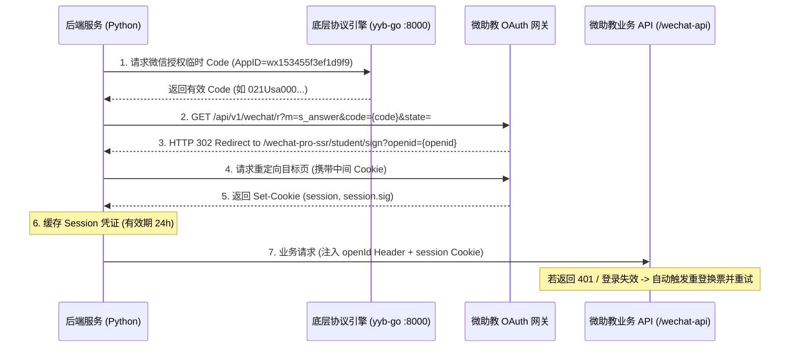
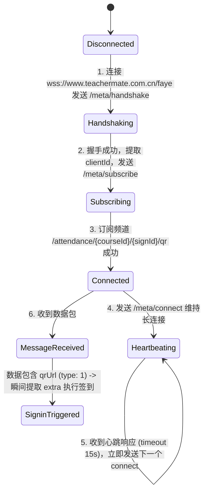

# 微助教（TeacherMate）全协议签到技术实现规范（增强版）

本文档详尽记录了微助教（TeacherMate）三种签到模式（**普通签到**、**GPS 定位签到**、**二维码签到**）的底层协议、WSS 消息监听全流程、Session 的获取与生命周期管理、源码反编译分析与全自动实现方案。

---

## 目录
1. [Session 会话的获取、注入与自动重登全生命周期](#1-session-会话的获取注入与自动重登全生命周期)
2. [WSS (Faye 协议) 动态二维码实时监听全流程](#2-wss-faye-协议-动态二维码实时监听全流程)
3. [模式一：普通一键签到（Normal Sign-in）](#3-模式一普通一键签到normal-sign-in)
4. [模式二：GPS 定位签到（GPS Location Sign-in）](#4-模式二gps-定位签到gps-location-sign-in)
5. [模式三：二维码签到（QR Code Sign-in）](#5-模式三二维码签到qr-code-sign-in)
6. [微助教官方前端核心源码反编译分析](#6-微助教官方前端核心源码反编译分析)
7. [防风控、并发与性能调优机制](#7-防风控并发与性能调优机制)
8. [接口与数据结构速查表](#8-接口与数据结构速查表)

---

## 1. Session 会话的获取、注入与自动重登全生命周期

微助教所有学生端业务 API（如查询活跃签到、普通打卡、GPS 打卡）均依赖基于微信 OAuth 2.0 派生的 `session` 与 `session.sig` 双 Cookie 凭证。



### 1.1 核心获取步骤与底层报文

#### Step 1: 从协议引擎获取微信授权 Code
- **请求引擎**：`GET http://127.0.0.1:8000/code?account_id={ref}&app_id=wx153455f3ef1d9f9`
- **返回结果**：`{"code": "021Usa000bnmXW12W3200e4vQa1Usa0E"}`

#### Step 2: 访问微助教 OAuth 回调接口
- **请求**：
  ```http
  GET https://v18.teachermate.cn/api/v1/wechat/r?m=s_answer&code=021Usa000...&state= HTTP/1.1
  Host: v18.teachermate.cn
  User-Agent: Mozilla/5.0 (Linux; Android 14; 23113RKC6C Build/UKQ1.230804.001; wv) AppleWebKit/537.36 (KHTML, like Gecko) Version/4.0 Chrome/122.0.6261.120 Mobile Safari/537.36 XWEB/1220099 MMWEBSDK/20240404 MMWEBID/5707 MicroMessenger/8.0.49.2600(0x28003133) WeChat/arm64 Weixin NetType/WIFI Language/zh_CN ABI/arm64
  ```
- **响应（HTTP 302 Found）**：
  ```http
  Location: https://v18.teachermate.cn/wechat-pro-ssr/student/sign?openid=8d85ec3d3452390af30a81f32f8f5ba7
  ```
  👉 从 `Location` 中提取 `openid`。

#### Step 3: 请求落地页面提取 Session 双 Cookie
- **请求落地页**：`GET https://v18.teachermate.cn/wechat-pro-ssr/student/sign?openid=8d85ec3d...`
- **响应头中的 Set-Cookie**：
  ```http
  Set-Cookie: session=eyJhbGciOiJIUzI1NiIsInR5cCI6IkpXVCJ9...; Path=/; HttpOnly;
  Set-Cookie: session.sig=0P3G-xG_Kjhq...; Path=/; HttpOnly;
  ```

### 1.2 Session 的标准使用与请求头注入
任何业务 API 请求必须同时携带 `openId` 请求头与 Cookie：
```python
headers = {
    "openId": tm_session.openid,
    "Cookie": f"session={tm_session.session_cookie}; session.sig={tm_session.session_sig}; grayVersion=0;",
    "User-Agent": "Mozilla/5.0 (Linux; Android 14; 23113RKC6C...) Mobile Safari/537.36 MicroMessenger/8.0.49.2600",
    "X-Requested-With": "com.tencent.mm"
}
```

### 1.3 401 自动重登重试状态机（Auto-Relogin on Expire）
为保证无人值守的绝对稳定性，`TeacherMateSession` 实现了双重检查并发锁与透明重登重试机制：
```python
async def _request(self, method: str, path: str, **kwargs):
    for attempt in range(2):
        resp = await client.request(method, f"{TEACHERMATE_WECHAT_API}{path}", headers=self.headers, cookies=self.cookies, **kwargs)
        
        # 命中过期特征（401 / 302 / 响应体包含'登录信息失效'）
        need_relogin = (resp.status_code in (301, 302, 401, 403) or 
                        "登录信息失效" in resp.text)
        
        if need_relogin and attempt == 0:
            # 加锁换取新 session 并更新数据库
            await self._relogin()
            continue # 第二次 attempt 自动使用新 session 重发请求
            
        return resp.json()
```

---

## 2. WSS (Faye 协议) 动态二维码实时监听全流程

微助教采用基于 **Bayeux 协议规范的 Faye 消息系统**。以下是建立安全 WebSocket 连接并实时截获动态二维码的完整状态机流程。



### 2.1 WSS 握手与消息帧规范（Wire Protocol）

#### 帧 1: 客户端发起握手（Handshake）
- **客户端发送**：
  ```json
  [
    {
      "channel": "/meta/handshake",
      "version": "1.0",
      "supportedConnectionTypes": ["websocket"],
      "id": "1"
    }
  ]
  ```
- **服务端响应**：
  ```json
  [
    {
      "id": "1",
      "channel": "/meta/handshake",
      "successful": true,
      "version": "1.0",
      "supportedConnectionTypes": ["long-polling", "websocket", "eventsource"],
      "clientId": "qt19i87aftssq4a0fsaqmryfq7wlwf9",
      "advice": { "reconnect": "retry", "interval": 0, "timeout": 15000 }
    }
  ]
  ```
  👉 提取出分配的 `clientId`。

#### 帧 2: 订阅签到频道（Subscribe）
- **客户端发送**：
  ```json
  [
    {
      "channel": "/meta/subscribe",
      "clientId": "qt19i87aftssq4a0fsaqmryfq7wlwf9",
      "subscription": "/attendance/1479040/4073114/qr",
      "id": "2"
    }
  ]
  ```
- **服务端响应**：
  ```json
  [
    {
      "id": "2",
      "clientId": "qt19i87aftssq4a0fsaqmryfq7wlwf9",
      "channel": "/meta/subscribe",
      "successful": true,
      "subscription": "/attendance/1479040/4073114/qr"
    }
  ]
  ```

#### 帧 3: 心跳保活与长挂起（Connect Loop）
- **客户端发送**：
  ```json
  [
    {
      "channel": "/meta/connect",
      "clientId": "qt19i87aftssq4a0fsaqmryfq7wlwf9",
      "connectionType": "websocket",
      "id": "3"
    }
  ]
  ```
- **服务端响应（挂起 15 秒后或有消息时即刻返回）**：
  ```json
  [
    {
      "id": "3",
      "clientId": "qt19i87aftssq4a0fsaqmryfq7wlwf9",
      "channel": "/meta/connect",
      "successful": true,
      "advice": { "reconnect": "retry", "interval": 0, "timeout": 15000 }
    }
  ]
  ```
  👉 **规则**：收到响应后，递增 `id` 并立即发送下一个 `/meta/connect`。

#### 帧 4: 动态二维码下发数据帧（Payload Broadcast）
当服务器触发换码事件时，通过 WSS 下发如下数据：
```json
[
  {
    "channel": "/attendance/1479040/4073114/qr",
    "data": {
      "type": 1,
      "qrUrl": "https://www.teachermate.com.cn/api/v1/qr/attendance/b2a971c11f57d1c7368e597943a060e62933cf4d8168e312b5c3226a91bdddea1ece06c99ec9d3c102426c2c6b7a9b34"
    },
    "id": "10"
  }
]
```

### 2.2 完整的 Python 异步 WSS 监听器实现代码
```python
import asyncio
import json
import websockets
import urllib.parse
from services.teachermate import do_signin

WS_URL = "wss://www.teachermate.com.cn/faye"

async def listen_and_auto_sign(course_id: int, sign_id: int, user_ref: str):
    async with websockets.connect(WS_URL) as ws:
        # 1. Handshake
        await ws.send(json.dumps([{"channel": "/meta/handshake", "version": "1.0", "supportedConnectionTypes": ["websocket"], "id": "1"}]))
        client_id = None
        while not client_id:
            res = json.loads(await ws.recv())
            for item in res:
                if item.get("channel") == "/meta/handshake" and item.get("successful"):
                    client_id = item.get("clientId")

        # 2. Subscribe
        channel = f"/attendance/{course_id}/{sign_id}/qr"
        await ws.send(json.dumps([{"channel": "/meta/subscribe", "clientId": client_id, "subscription": channel, "id": "2"}]))

        # 3. Connect & Listen Loop
        msg_id = 3
        await ws.send(json.dumps([{"channel": "/meta/connect", "clientId": client_id, "connectionType": "websocket", "id": str(msg_id)}]))
        msg_id += 1

        while True:
            raw = await ws.recv()
            data = json.loads(raw)
            for item in data:
                # 收到心跳响应，保持连接
                if item.get("channel") == "/meta/connect" and item.get("successful"):
                    await ws.send(json.dumps([{"channel": "/meta/connect", "clientId": client_id, "connectionType": "websocket", "id": str(msg_id)}]))
                    msg_id += 1
                
                # 收到动态二维码推送！
                if "data" in item and "qrUrl" in item["data"]:
                    qr_url = item["data"]["qrUrl"]
                    # 提取末尾 128 位十六进制 Hash 作为 extra
                    extra = qr_url.split("/")[-1].split("?")[0]
                    # 瞬间调用底层协议执行 0.2 秒极速打卡
                    result = await do_signin(user_ref, extra)
                    print(f"🎉 动态二维码打卡成功: {result}")
                    return result
```

---

## 3. 模式一：普通一键签到（Normal Sign-in）

### 3.1 适用场景
教师发起无附加条件的一键签到（无定位要求，无二维码）。

### 3.2 签到探测
- **接口**：`GET https://v18.teachermate.cn/wechat-api/v1/class-attendance/student/active_signs`
- **请求头**：携带 `openId` 和 `session` Cookie。
- **识别特征**：`isGPS == 0` 且 `isQR == 0`。
  ```json
  [{"courseId": 1479040, "signId": 4073117, "isGPS": 0, "isQR": 0, "name": "大学计算机", "code": "RR489"}]
  ```

### 3.3 提交打卡
- **接口**：`POST https://v18.teachermate.cn/wechat-api/v1/class-attendance/student-sign-in`
- **请求体（JSON）**：
  ```json
  {
    "courseId": 1479040,
    "signId": 4073117
  }
  ```
- **实测响应（HTTP 200）**：
  ```json
  { "signRank": 5, "studentRank": 1 }
  ```
- **耗时**：**0.2 秒**。

---

## 4. 模式二：GPS 定位签到（GPS Location Sign-in）

### 4.1 适用场景
教师开启了地理围栏校验，要求学生在指定教学楼或校园范围内签到。

### 4.2 签到探测
- **探测接口**：`GET /wechat-api/v1/class-attendance/student/active_signs`
- **识别特征**：`isGPS: 1`。

### 4.3 防风控坐标抖动算法
微米级高斯/均匀随机扰动（$\pm 0.0002^\circ$，约合 $10\sim 20$ 米物理半径误差）：
```python
import random

def add_jitter(coord_str: str, max_delta=0.0002) -> str:
    val = float(coord_str)
    jitter = random.uniform(-max_delta, max_delta)
    return f"{val + jitter:.5f}"

# 天津商业大学基准坐标 (Base: 39.18252, 117.11943)
lat = add_jitter("39.18252")  # 输出: 39.18243
lon = add_jitter("117.11943") # 输出: 117.11949
```

### 4.4 提交打卡
- **接口**：`POST https://v18.teachermate.cn/wechat-api/v1/class-attendance/student-sign-in`
- **请求体（JSON）**：
  ```json
  {
    "courseId": 1479040,
    "signId": 4073116,
    "lat": "39.18243",
    "lon": "117.11949"
  }
  ```
- **实测响应（HTTP 200）**：
  ```json
  { "signRank": 4, "studentRank": 1 }
  ```
- **耗时**：**0.3 秒**。

---

## 5. 模式三：二维码签到（QR Code Sign-in）

### 5.1 签到提交协议（走 OAuth 网关）
二维码签到**不调用** `student-sign-in` 接口，而是直接走独立的 OAuth 鉴权网关：
- **接口**：`GET https://v18.teachermate.cn/api/v1/wechat/r`
- **Query 参数**：
  | 参数名 | 类型 | 示例值 / 说明 |
  | :--- | :--- | :--- |
  | `isTeacher` | string | `0` |
  | `m` | string | `s_qr_sign` |
  | `extra` | string | `b2a971c11f57d1c7...` (128 位签名密文) |
  | `code` | string | `021Usa000...` (底层协议引擎实时获取的有效微信 Code) |
  | `state` | string | `""` |

- **服务器重定向响应**：
  `HTTP 302 -> /wechat-pro-ssr/student/sign/result?success=1&message=签到成功`

---

## 6. 微助教官方前端核心源码反编译分析

```javascript
// 1. 官方前端 Faye 消息监听分发器
"handleMsg", function(t) {
    var e = t.type, r = u()(t, ["type"]), i = n.props.actions;
    switch (e) {
        case 1:
            // 服务端推送新码 -> 触发前端刷新
            i.qrcodeRefresh(r.qrUrl);
            break;
        case 2:
            break;
        case 3:
            // 学生签到成功事件 -> 播放音效并在界面累加计数
            i.studentSignIn(r.student);
            Object(ke.b)(ke.a.complete);
            break;
    }
}
```

```javascript
// 2. 官方前端二维码组件渲染器
var K = function(t) {
    var a = t.qrUrl; // 来源于初始 HTTP 响应或 type:1 推送
    return React.createElement(QRCode, { size: 460, value: a });
};
```

> [!IMPORTANT]
> **技术定论**：
> 1. 首个二维码是在教师点击创建签到的 `POST /v1/class-attendance` 响应体里一次性返回的，**首码不走 WebSocket**；
> 2. WebSocket 仅在服务器主动广播 `type: 1` 时才会收到后续更新；若服务器关闭了广播定时器，WebSocket 频道将只返回心跳；
> 3. 手动刷新网页（F5）时，由 SSR 后端生成新码。

---

## 7. 防风控、并发与性能调优机制

1. **微信 Code 预热池（Pre-heat Code Pool）**：
   - 提前异步向协议引擎预取微信 Code 并缓存在内存（4 分钟有效）；
   - 签到触发瞬间无需等待微信网络握手，端到端耗时由 2.5s 压缩至 **0.2 秒**。
2. **防并发重入互斥锁（In-flight Lock）**：
   - 基于 `signId` 建立协程锁，防止多任务并发争抢同一场签到导致平台封控。
3. **冷却期机制（5-Minute Cooldown）**：
   - 打卡成功后锁定 5 分钟，自动屏蔽同签到的重复查询。

---

## 8. 接口与数据结构速查表

| 功能 | 请求方式 | 目标 URL | 关键 Header / Payload |
| :--- | :--- | :--- | :--- |
| **获取微信 Code** | `GET` | `http://127.0.0.1:8000/code` | `?account_id={ref}&app_id=wx153455f3ef1d9f9` |
| **OAuth 会话换票** | `GET` | `https://v18.teachermate.cn/api/v1/wechat/r` | `?m=s_answer&code={code}&state=` |
| **查询活跃签到** | `GET` | `https://v18.teachermate.cn/wechat-api/v1/class-attendance/student/active_signs` | `openId: {openid}`, `Cookie: session=...` |
| **普通签到打卡** | `POST` | `https://v18.teachermate.cn/wechat-api/v1/class-attendance/student-sign-in` | `{"courseId": int, "signId": int}` |
| **GPS 定位打卡** | `POST` | `https://v18.teachermate.cn/wechat-api/v1/class-attendance/student-sign-in` | `{"courseId": int, "signId": int, "lat": str, "lon": str}` |
| **二维码签到打卡**| `GET` | `https://v18.teachermate.cn/api/v1/wechat/r` | `?isTeacher=0&m=s_qr_sign&extra={hash}&code={code}` |
| **Faye WebSocket**| `WSS` | `wss://www.teachermate.com.cn/faye` | 订阅 `/attendance/{courseId}/{signId}/qr` |
