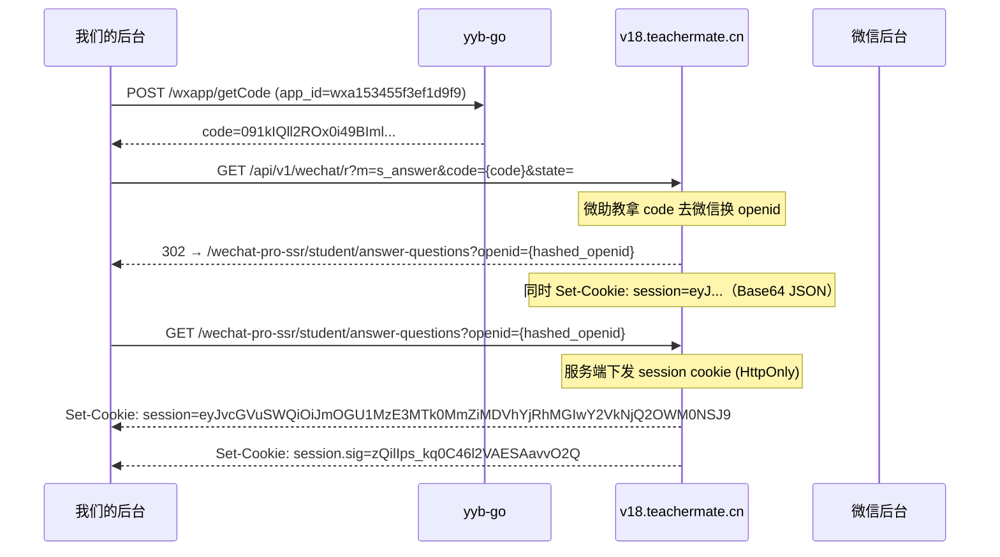
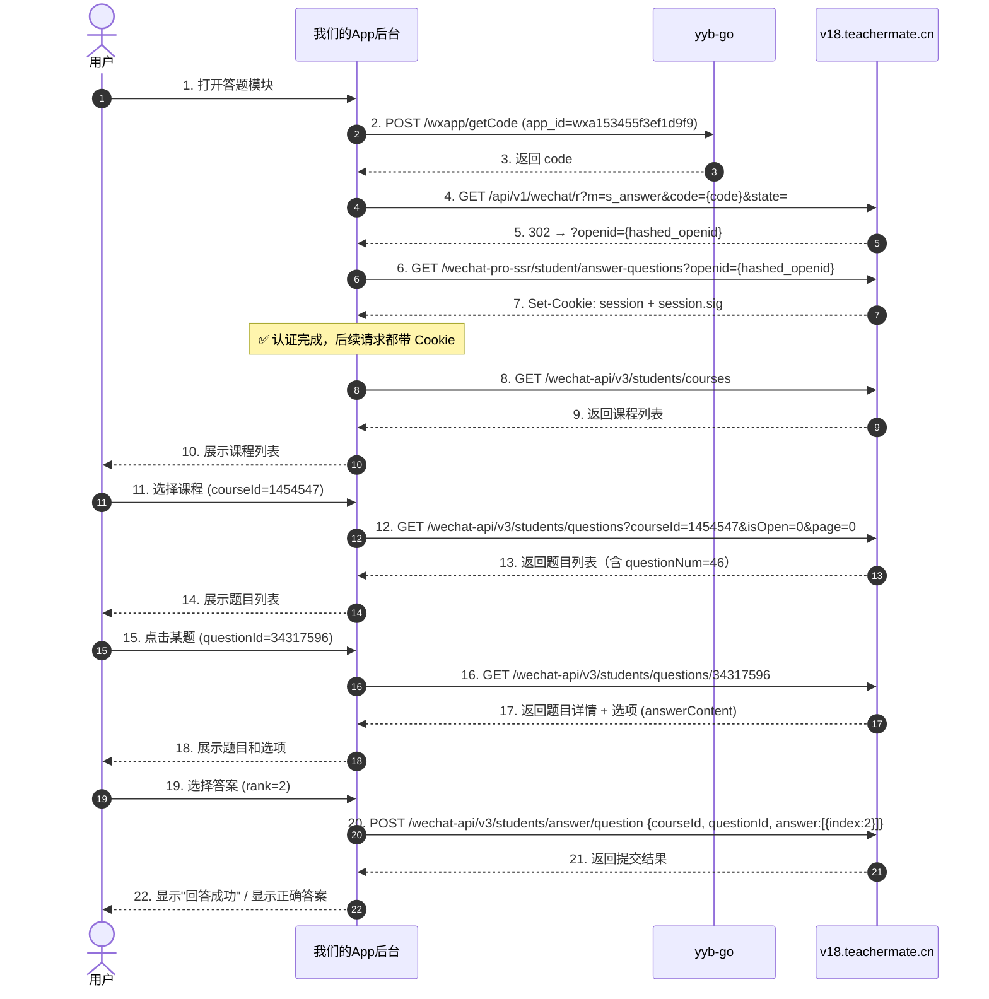

# 微助教答题模块 - 完整协议分析

## 一、认证流程（答题模块专属）

答题模块的认证和签到模块走的是**同一套 OAuth 流程**，但 `m` 参数不同：



### session cookie 解码

session cookie 是 Base64 编码的 JSON：

```
eyJvcGVuSWQiOiJmOGU1MzE3MTk0MmZiMDVhYjRhMGIwY2VkNjQ2OWM0NSJ9
→ {"openId":"f8e53171942fb05ab4a0b0ced6469c45"}
```

> [!IMPORTANT]
> 所有后续 API 调用的认证都依赖 **两个 Cookie**：
> - `session` = Base64 JSON（含 openId）
> - `session.sig` = HMAC 签名（防篡改）
>
> 这两个 Cookie 在访问 `/wechat-pro-ssr/student/answer-questions?openid=xxx` 页面时由服务端 Set-Cookie 下发。
> 所以**我们必须先完成 OAuth 获取 openid，然后访问该页面拿到 session cookie，之后才能调 API**。

### 关键差异：签到 vs 答题 的 `m` 参数

| 功能 | OAuth 回调 URL 的 `m` 参数 | 重定向目标 |
|------|----------------------|----------|
| 签到 | `m=s_qr_sign` | `/student/signresult?success=0\|1&message=...` |
| 答题 | `m=s_answer` | `/student/answer-questions?openid=xxx` |

---

## 二、API 接口完整清单

Base URL: `https://v18.teachermate.cn/wechat-api`

### 2.1 课程相关

| 接口 | 方法 | 说明 | 认证 |
|------|------|------|------|
| `/v3/students/courses` | GET | 获取学生加入的课程列表 | Cookie: session + session.sig |
| `/v3/students/courses/{courseId}/chapters` | GET | 获取课程章节列表 | 同上 |

### 2.2 题目列表

| 接口 | 方法 | 说明 |
|------|------|------|
| `/v3/students/questions` | GET | 获取题目列表（分页） |
| `/v3/students/papers` | GET | 获取试卷列表 |

**`/v3/students/questions` 参数：**

| 参数 | 类型 | 说明 |
|------|------|------|
| `courseId` | int | 课程 ID（必填） |
| `isOpen` | int | 0=全部, 1=开放中 |
| `page` | int | 页码，从 0 开始 |
| `chapterId` | int | 章节 ID（可选，筛选指定章节） |
| `sectionId` | int | 小节 ID（可选） |
| `isAnswered` | int | 0=未答, 1=已答, 2=不限 |
| `isCorrect` | int | 筛选正确/错误（可选） |

**响应示例：**
```json
{
  "questionNum": 46,
  "paperNum": 0,
  "questions": [
    {
      "id": 34317596,
      "code": "T0011-1",
      "type": 1,             // 题目类型（见下方映射）
      "difficulty": 1,
      "isObjective": 1,       // 1=客观题, 0=主观题
      "content": "真空中一根无限长直细导线上通电流 I...",
      "status": 2,            // 1=开放中, 2=已关闭, 3=定时开放
      "answerOpen": 1,        // 1=答案可查看, 0=不可查看
      "onTime": 1,
      "timingClose": null,
      "lastOpenTime": "2026-06-11T01:21:42.000Z",
      "isAnswered": 0,        // 0=未答, 1=已答
      "isCorrect": null       // null=未判, true/false
    }
  ]
}
```

### 2.3 题目详情

| 接口 | 方法 | 说明 |
|------|------|------|
| `/v3/students/questions/{questionId}` | GET | 获取单个题目详情（含选项） |

**响应示例（选择题）：**
```json
{
  "id": 34143023,
  "code": "T0004-1",
  "content": "<p>有一半径为 R 的单匝圆线圈...</p>",
  "type": 1,
  "isObjective": 1,
  "blankNum": null,
  "minChosen": null,
  "maxChosen": null,
  "status": 2,
  "answerOpen": 1,
  "reviewOpen": 0,
  "isAnswered": 0,
  "answerContent": [
    {"content": "<p>4 倍和 1/8</p>", "rank": 0, "answer": false},
    {"content": "<p>4 倍和 1/2</p>", "rank": 1, "answer": false},
    {"content": "<p>2 倍和 1/4</p>", "rank": 2, "answer": false},
    {"content": "<p>2 倍和 1/2</p>", "rank": 3, "answer": false}
  ],
  "review": ""
}
```

> [!NOTE]
> **正确答案与学生答案是两套字段**：`answerContent[].answer` 是标准答案标记，不能拿来回显学生选择；学生已提交的选择在详情的 `answer` 中，形如 `[{"rank": 1}]`。即使 `answerOpen=0`，本次 HAR 的已答题详情也返回了该字段。

### 2.4 提交答案

| 接口 | 方法 | 说明 |
|------|------|------|
| `/v3/students/answer/question` | POST | 提交单题答案 |
| `/v3/students/answer/paper` | POST | 提交试卷答案 |
| `/v3/students/answer/paper/temp` | POST | 暂存试卷答案（草稿） |

**单题提交 `/v3/students/answer/question` 请求体（从前端 JS 提取）：**
```json
{
  "courseId": 1454547,
  "questionId": 34317596,
  "answer": [{"index": 0}], // 单选/判断；多选为多个 {"index": rank}
  "files": [],             // 图片附件 key 数组（主观题）
  "audio": []              // 语音附件 key 数组（主观题）
}
```

> [!IMPORTANT]
> 官方 `48.1cae5dbc.chunk.js` 的选择事件保存 `[{index: e}]`，提交时原样发送。
> 输入若写成 `[2]`，服务端会尝试给数字元素写 `rank`，从而报
> `Cannot create property 'rank' on number '2'`。详情响应则使用 `[{rank: 2}]`，输入与输出字段名不同。

填空题直接提交字符串数组，例如 `["第一空", "第二空"]`；主观题文字为一个字符串，附件仍放在 `files`/`audio`。

**试卷提交 `/v3/students/answer/paper` 请求体：**
```json
{
  "courseId": 1454547,
  "paperId": 12345,
  "answer": {
    "34317596": {"questionId": 34317596, "answer": [0]},
    "34317595": {"questionId": 34317595, "answer": [2]}
  },
  "isOnceAnswer": 1         // 1=首次提交（可选）
}
```

### 2.5 其他辅助接口

| 接口 | 方法 | 说明 |
|------|------|------|
| `/v1/jssdk` | POST | 获取微信 JS-SDK 签名（用于分享等） |
| `/v1/transcode` | POST | 上传文件/图片转码 |

---

## 三、题目类型映射

从前端 JS 中提取的 `questionType` 对照表：

| type 值 | 题型 | isObjective | answer 格式 |
|---------|------|-------------|-------------|
| 0 | 阅读状态题 | - | 官方前端走阅读状态提交逻辑 |
| 1 | 单选题 | 1 | `[{"index": rank}]` |
| 2 | 多选题 | 1 | `[{"index": rank1}, {"index": rank2}]` |
| 3 | 判断题 | 1 | `[{"index": 0}]` 或 `[{"index": 1}]` |
| 4 | 填空题 | 1 | `["答案1", "答案2", ...]` |
| 5 | 主观题/简答题 | 0 | `"文字答案"` + files + audio |
| 6 | 排序题 | - | 官方前端排序分支 |

> [!TIP]
> 判断题在前端代码中有一个 `getYesOrNoChoiceArr` 函数，生成固定的两个选项。
> 多选题有 `minChosen` 和 `maxChosen` 字段限制选择数量。

---

## 四、题目状态说明

| 字段 | 值 | 含义 |
|------|------|------|
| `status` | 1 | 开放中（可答题） |
| `status` | 2 | 已关闭（不可答题） |
| `status` | 3 | 定时开放中 |
| `answerOpen` | 0 | 答案不可查看 |
| `answerOpen` | 1 | 答案可查看（关闭后公布） |
| `isAnswered` | 0 | 未答 |
| `isAnswered` | 1 | 已答 |
| `onTime` | 1 | 限时题目 |

---

## 五、前端路由结构（React Router）

```
/student/answer-questions                                    → 选择课程页
/student/answer-questions/:courseId                           → 题目列表页
/student/answer-questions/:courseId/questions/:questionsId    → 单题详情/作答页
/student/answer-questions/:courseId/papers/:papersId          → 试卷作答页
/student/sign/:history?/:courseId?                            → 签到页
/student/signresult                                          → 签到结果页
/answer-doubt/select-course                                  → 答疑选课
/answer-doubt/:cId/list                                      → 答疑列表
```

---

## 六、完整答题流程时序图



---

## 七、实现要点

### 获取 session cookie 的完整步骤

```python
import httpx

# Step 1: 获取 code
code_resp = httpx.post("http://127.0.0.1:8999/wxapp/getCode", json={
    "ref": "owNAX6hgehW_U1G54tKOrnICfYRs",
    "app_id": "wxa153455f3ef1d9f9"
})
code = code_resp.json()["data"]["result"]["code"]

# Step 2: OAuth 回调 (获取 openid)
client = httpx.Client(follow_redirects=False)
oauth_resp = client.get("https://v18.teachermate.cn/api/v1/wechat/r", params={
    "m": "s_answer",
    "code": code,
    "state": ""
})
# Location 中有 openid
location = oauth_resp.headers["location"]
openid = location.split("openid=")[1]

# Step 3: 访问页面获取 session cookie
page_resp = client.get(location, follow_redirects=True)
session_cookie = client.cookies.get("session")
session_sig = client.cookies.get("session.sig")

# Step 4: 后续所有 API 调用都带这些 Cookie
api_client = httpx.Client(cookies={
    "session": session_cookie,
    "session.sig": session_sig,
    "grayVersion": "0"
})

# 获取课程列表
courses = api_client.get("https://v18.teachermate.cn/wechat-api/v3/students/courses").json()

# 获取题目列表
questions = api_client.get("https://v18.teachermate.cn/wechat-api/v3/students/questions", params={
    "courseId": 1454547,
    "isOpen": 0,
    "page": 0
}).json()

# 获取题目详情
detail = api_client.get(f"https://v18.teachermate.cn/wechat-api/v3/students/questions/34317596").json()

# 提交答案
submit = api_client.post("https://v18.teachermate.cn/wechat-api/v3/students/answer/question", json={
    "courseId": 1454547,
    "questionId": 34317596,
    "answer": [{"index": 2}],  # 选择 rank=2 的选项；提交字段必须叫 index
    "files": [],
    "audio": []
})
```

### 需要注意的限制

1. **题目状态 `status`**：只有 `status=1`（开放中）的题目才能提交答案。`status=2` 的题目已关闭，提交会被拒绝。
2. **`isAnswered`**：已答题目可能不允许重复提交（取决于老师设置）。
3. **试卷的 `isOnceAnswer`**：某些试卷只允许提交一次。
4. **定时题目 `timingClose`**：有些题目有倒计时，超时自动关闭。
5. **session 过期**：从 Set-Cookie 的 `expires` 看，session 有效期约 24 小时。
