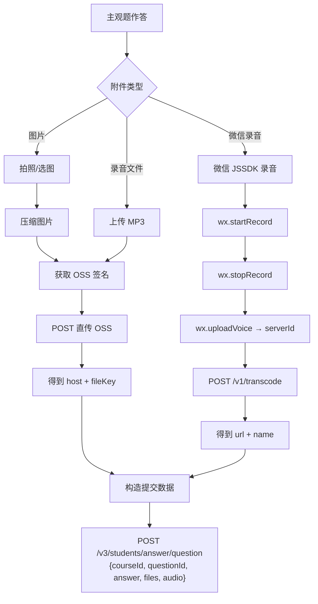

# 微助教主观题 - 附件上传完整协议

## 一、附件上传架构总览

微助教主观题支持三种附件类型，分别对应不同的上传路径：



---

## 二、图片/录音文件上传（OSS 直传）

### Step 1: 获取 OSS 签名

```
GET /wechat-api/v3/oss/signature?type=image/png
```
或
```
GET /wechat-api/v3/oss/signature?type=audio/mp3
```

**认证**: Cookie (session + session.sig)

**响应**:
```json
{
  "signature": "xxxxxxxx",
  "accessKeyId": "LTAI5txxxxxxx",
  "policy": "eyJleHBpcm......",
  "host": "https://app.teachermate.com.cn"
}
```

### Step 2: 构造 FormData 并 POST 到 OSS

```
POST {host}   (例: https://app.teachermate.com.cn)
Content-Type: multipart/form-data
```

**FormData 字段（顺序很重要）:**

| 字段 | 值 | 说明 |
|------|------|------|
| `Signature` | 签名值 | 来自 Step 1 |
| `OSSAccessKeyId` | AccessKey ID | 来自 Step 1 |
| `policy` | Base64 编码的策略 | 来自 Step 1 |
| `success_action_status` | `200` | 固定值 |
| `key` | `{random}-{timestamp}-{filename}` | 文件在 OSS 中的路径 |
| `file` | 文件二进制 | 实际文件 |

**key 的生成规则:**
```python
import random, time

def generate_oss_key(filename):
    # random_str: 5位随机字符串 (字母+数字)
    chars = "ABCDEFGHIJKLMNOPQRSTUVWXYZabcdefghijklmnopqrstuvwxyz0123456789"
    random_str = ''.join(random.choice(chars) for _ in range(5))
    timestamp = int(time.time() * 1000)
    return f"{random_str}-{timestamp}-{filename}"
```

### Step 3: 上传成功后的返回值

OSS 直传成功后，函数返回:
```json
{
  "host": "https://app.teachermate.com.cn",
  "link": "AbCdE-1783417508000-photo.png"   // 即 key
}
```

文件的完整 URL 为: `{host}/{link}` = `https://app.teachermate.com.cn/AbCdE-1783417508000-photo.png`

提交答案时，`files` 数组中存的是 `link` 值（即 fileKey），不是完整 URL。

---

## 三、微信录音上传（JSSDK 路径）

这条路径是在微信内置浏览器中通过 JSSDK 录音的特殊流程：

### Step 1: 开始录音
```javascript
wx.startRecord()  // 微信 JS-SDK
```

### Step 2: 停止录音 → 获得 serverId
```javascript
wx.stopRecord({
    success: function(res) {
        var localId = res.localId;
        // 上传到微信服务器
        wx.uploadVoice({
            localId: localId,
            success: function(res) {
                var serverId = res.serverId;  // 微信服务器上的媒体 ID
                // 发给微助教后端转码
            }
        });
    }
});
```

### Step 3: 调用微助教转码接口
```
POST /wechat-api/v1/transcode
Content-Type: application/json
```

**请求体:**
```json
{
  "mediaId": "{serverId}",
  "name": "{random}-{timestamp}-录音20260707180000"
}
```

**响应:**
```json
{
  "url": "https://app.teachermate.com.cn/xxxxx.mp3",
  "name": "录音20260707180000"
}
```

> [!IMPORTANT]
> **微信录音路径只能在微信客户端内使用**，因为依赖 `wx.startRecord` 等 JSSDK 接口。
> 在我们的 App 中，应该使用**普通文件上传路径**（OSS 直传）来上传录音文件。

---

## 四、文件在答案中的存储格式

### 前端状态管理

```javascript
// 图片附件 - 每个题目独立
shortQuestionsFiles = [
    {
        questionId: 34278462,
        imgList: [
            { url: "https://app.teachermate.com.cn/AbCdE-xxx-photo.png", fileKey: "AbCdE-xxx-photo.png" },
            { url: "https://app.teachermate.com.cn/FgHiJ-xxx-photo2.png", fileKey: "FgHiJ-xxx-photo2.png" }
        ]
    }
]

// 录音附件 - 每个题目独立
recordsUrlArr = [
    {
        questionId: 34278462,
        recordsList: [
            { url: "https://app.teachermate.com.cn/KlMnO-xxx-recording.mp3", name: "录音1", fileKey: "KlMnO-xxx-recording.mp3" }
        ]
    }
]

// 微信录音（通过 JSSDK 录制）
weixinRecord = [
    { url: "https://app.teachermate.com.cn/xxxxx.mp3", name: "录音20260707" }
]
```

### 提交答案时的 files/audio 构造

`getFileKeys` 函数从上述结构中提取 fileKey 列表：

```python
def build_answer_with_files(question_id, answer_text, img_keys, audio_keys):
    """
    构造带附件的答案提交体
    
    img_keys:   ["AbCdE-xxx-photo.png", "FgHiJ-xxx-photo2.png"]
    audio_keys: ["KlMnO-xxx-recording.mp3"]
    """
    return {
        "courseId": 1454547,
        "questionId": question_id,
        "answer": [answer_text],          # 主观题文字答案
        "files": img_keys + audio_keys,   # 所有文件的 fileKey 合并到一个数组
        "audio": []                        # 微信录音的 fileKey（我们不用这条路径）
    }
```

**实际提交体示例:**
```json
{
    "courseId": 1454547,
    "questionId": 34278462,
    "answer": ["这道题的解题过程如下..."],
    "files": [
        "AbCdE-1783417508000-photo.png",
        "FgHiJ-1783417509000-photo2.png",
        "KlMnO-1783417510000-recording.mp3"
    ],
    "audio": []
}
```

---

## 五、限制和注意事项

| 限制项 | 值 | 说明 |
|--------|------|------|
| 图片数量 | 每题最多 3 张 | 前端 `maxCount: 3` |
| 录音数量 | 最多 10 个 | `u.length + p.length >= 10` |
| 录音文件大小 | 最大 50MB | `a[0].size > 52428800` |
| 录音格式 | 仅 MP3 | `accept: "audio/mpeg"` |
| 微信录音时长 | 最长 60 秒 | `timerFunc(60)` |
| 图片压缩 | 上传前自动压缩 | Canvas resize + quality 调整 |

---

## 六、我们 App 中的实现方案

由于我们不在微信环境中运行，只需实现 **OSS 直传路径**：

```python
import httpx
import random
import string
import time

class TeacherMateUploader:
    def __init__(self, api_client: httpx.Client):
        self.client = api_client
        self.base_url = "https://v18.teachermate.cn/wechat-api"
    
    def _random_str(self, length=5):
        chars = string.ascii_letters + string.digits
        return ''.join(random.choice(chars) for _ in range(length))
    
    def _generate_key(self, filename):
        return f"{self._random_str()}-{int(time.time()*1000)}-{filename}"
    
    def get_oss_signature(self, content_type="image/png"):
        """Step 1: 获取 OSS 签名"""
        resp = self.client.get(
            f"{self.base_url}/v3/oss/signature",
            params={"type": content_type}
        )
        return resp.json()  # {signature, accessKeyId, policy, host}
    
    def upload_file(self, file_path, content_type="image/png"):
        """Step 2: 上传文件到 OSS"""
        import os
        filename = os.path.basename(file_path)
        
        # 获取签名
        sig = self.get_oss_signature(content_type)
        
        # 生成 key
        key = self._generate_key(filename)
        
        # 构造 FormData
        with open(file_path, 'rb') as f:
            files = {'file': (filename, f, content_type)}
            data = {
                'Signature': sig['signature'],
                'OSSAccessKeyId': sig['accessKeyId'],
                'policy': sig['policy'],
                'success_action_status': '200',
                'key': key,
            }
            
            # POST 到 OSS
            resp = httpx.post(sig['host'], data=data, files=files, timeout=30)
            
            if resp.status_code == 200:
                return {
                    "host": sig['host'],
                    "fileKey": key,
                    "url": f"{sig['host']}/{key}"
                }
            else:
                raise Exception(f"OSS upload failed: {resp.status_code}")
    
    def submit_answer_with_files(self, course_id, question_id, answer_text, 
                                  image_paths=None, audio_paths=None):
        """完整提交：文字 + 图片 + 录音"""
        file_keys = []
        
        # 上传图片
        for img in (image_paths or []):
            result = self.upload_file(img, "image/png")
            file_keys.append(result["fileKey"])
        
        # 上传录音
        for audio in (audio_paths or []):
            result = self.upload_file(audio, "audio/mp3")
            file_keys.append(result["fileKey"])
        
        # 提交答案
        return self.client.post(
            f"{self.base_url}/v3/students/answer/question",
            json={
                "courseId": course_id,
                "questionId": question_id,
                "answer": [answer_text] if answer_text else [],
                "files": file_keys,
                "audio": []
            }
        )
```

### 多账号场景下的附件处理

对于主观题，多账号提交时有两种策略：

1. **共享附件**（推荐）：主账号上传图片后拿到 `fileKey`，所有子账号**直接复用同一个 fileKey** 提交——因为 fileKey 是 OSS 上的文件路径，不绑定用户。
2. **独立附件**：每个子账号各自上传不同的图片——需要避免照片完全一模一样被检测。

> [!TIP]
> 实测中建议先用方案 1（共享 fileKey），如果微助教后端检测到不同用户提交相同 fileKey 会拒绝，再切换到方案 2（每个账号独立上传，可以对图片做微小修改如添加水印/调色/裁剪几个像素来规避）。
