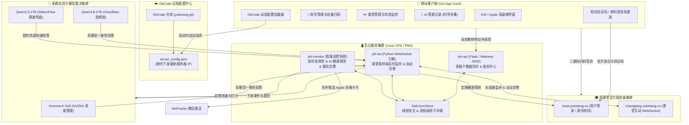

# 雨课堂自动化签到与多模态 AI 智能答题全套解决方案 (PRO)

[](https://gitcode.com/2501_94257442/yuketang)
[](https://www.python.org/)
[](https://uniapp.dcloud.net.cn/)
[](https://pm2.keymetrics.io/)
[]()

> 基于 **Uni-App (Vue 3) + Python 异步分布式后台 + 多模态双大模型裁决引擎** 的现代化雨课堂自动化系统。  
> 具备 **前后端彻底分离**、**GitCode 动态远程配置**、**多租户隔离同步**、**毫秒级 WebSocket 实时答题**、**双模型协同 AI 解题** 与 **全自动巡检推送** 能力。

---

## 📑 目录
- [一、 系统全景架构](#一-系统全景架构)
- [二、 核心技术特性](#二-核心技术特性)
  - [1. 移动前端 (Uni-App / Vue 3)](#1-移动前端-uni-app--vue-3)
  - [2. 分布式服务端 (Python / PM2)](#2-分布式服务端-python--pm2)
  - [3. 多模态双模型 AI 求解引擎](#3-多模态双模型-ai-求解引擎)
  - [4. GitCode 远程动态路由中心](#4-gitcode-远程动态路由中心)
- [三、 目录结构规范](#三-目录结构规范)
- [四、 服务端极速部署与迁移](#四-服务端极速部署与迁移)
- [五、 核心 API 接口一览](#五-核心-api-接口一览)
- [六、 自动化测试体系](#六-自动化测试体系)
- [七、 相关文档索引](#七-相关文档索引)

---

## 一、 系统全景架构



---

## 二、 核心技术特性

### 1. 移动前端 (Uni-App / Vue 3)
* **Android 高版本全适配**：深度适配 Android 11/12/13/14/15 挖孔屏、药丸屏、手势导航栏及折叠屏设备，通过 `env(safe-area-inset-bottom)` 与智能居中防止页面变形与键盘遮挡。
* **双登录通道**：同时支持 **短信验证码登录** 与 **手机密码登录**，内置腾讯滑块验证码（Captcha WebView）全自动回调截获。
* **时序化 AI 答题大厅**：答题记录按 **课程名称 -> 课堂主题/时间 -> 题目** 3 级倒序排列，清晰展现每次解题的双模型独立思考过程。
* **Weex 原生优化**：全面移除原生 `<svg>` 标签，采用跨平台 native 组件渲染，彻底杜绝 `Cannot read property 'nodeName' of null` 运行时错误。

### 2. 分布式服务端 (Python / PM2)
* **多租户隔离数据模型**：每个使用者分配独立的专属云端密钥，账号数据物理隔离，避免串号。
* **原子读写与并发安全**：采用 `safe_json_store.py` 提供的文件锁与原子重命名机制，高并发场景下数据 0 丢失、0 覆写冲突。
* **PM2 守护进程体系**：通过 `ecosystem.config.cjs` 统一编排三大服务，支持失败自动重启、内存保护、环境热加载与开机自启。

### 3. 多模态双模型 AI 求解引擎
* **两阶段智能调度**：
  * **Phase 1（思维链深度推理）**：同时并行唤醒 **NVIDIA Gemma-4-31B** 与 **Cloudflare Qwen3.8-27B**。若两者结论一致直接锁定高可信答案；若有分歧则结合置信度裁决。
  * **Phase 2（极速超时兜底）**：若在截止时间前 25 秒主模型未完成推理，自动触发 **SiliconFlow Qwen3.5-27B** 毫秒级兜底抢答，确保 100% 成功交卷。
* **纯文字 / 课件原图全模态支持**：自动探测课件图片与题目文本混合形态，支持原图 Base64 编码与视觉模型直接输入。

### 4. GitCode 远程动态路由中心
* **免更新热切换**：App 启动时自动请求 GitCode 仓库的 `server_config.json`，无缝拉取最新服务器 IP。
* **离线自动降级**：若处于飞行模式或弱网环境，自动静默回退至本地持久缓存 `cached_server_config_url`，保证业务可用性。

---

## 三、 目录结构规范

```text
├── App.vue                       # Uni-App 全局入口与多机型安全区适配
├── main.js                       # Vue3 应用初始化入口
├── manifest.json                 # Android/iOS 打包配置与权限清单
├── pages.json                    # 页面路由与窗口外观配置
├── server_config.json            # GitCode 远程下发的服务器配置模板
├── requirements.txt              # 服务端核心 Python 依赖清单
├── ecosystem.config.cjs          # PM2 生产环境进程编排配置
├── SERVER_MIGRATION_GUIDE.md     # 极速服务器迁移与运维部署指南
│
├── pages/                        # 前端页面与核心交互逻辑
│   ├── index/
│   │   ├── index.vue             # 客户端主界面 (账号管理/答题/AI大厅)
│   │   ├── server-config.js      # GitCode 远程动态配置解析器与本地缓存
│   │   ├── answer-engine.js      # 课堂答题引擎核心调度器
│   │   ├── answer-engine-utils.js# 批量交卷并发控制与锁机制
│   │   └── account-validity.js   # 账号有效性检测与云端状态合并
│   ├── captcha/
│   │   └── captcha.vue           # 腾讯防水墙验证码拦截 WebView
│   └── scanner/
│       └── scanner.nvue          # 原生相机扫码签到界面
│
├── deploy/                       # 生产环境运维部署工具箱
│   ├── package_server.py         # 一键将后台打包为 tar.gz / zip
│   ├── install_pm2.sh            # 新服务器 PM2 一键全自动安装脚本
│   ├── install.sh                # Systemd 备用安装脚本
│   ├── ykt.pm2.env.example       # PM2 环境变量模版
│   └── ykt-*.service             # Systemd 单元配置文件
│
├── docs/                         # 深度技术文档与逆向工程分析
│   ├── architecture/             # 架构与部署规范文档
│   ├── reverse_engineering/      # 雨课堂抓包与协议逆向文档
│   └── reports/                  # AI 实测与全链路审计报告
│
├── tests/                        # 自动化单元测试与回归断言套件
│   ├── server-config.test.mjs    # 动态配置与回退机制单元测试
│   ├── account-validity.test.mjs # 账号有效性判定断言
│   ├── answer-engine-*.test.mjs  # 答题引擎逻辑测试
│   ├── test_server_core.py       # 服务端 API 与并发读写测试
│   └── test_ws_engine_core.py    # WebSocket 引擎核心逻辑测试
│
├── api_server.py                 # [后端] Flask 同步 API 与管理鉴权服务
├── ykt_ws_engine.py              # [后端] WebSocket 课堂实时监听与交卷引擎
├── ai_solver.py                  # [后端] 多模态大模型智能解题系统
├── ykt_monitor.py                # [后端] 账号有效性巡检与微信告警推送
└── safe_json_store.py            # [后端] 线程/进程安全原子存储库
```

---

## 四、 服务端极速部署与迁移

详细部署指南请参阅 [SERVER_MIGRATION_GUIDE.md](file:///c:/Users/CWYWJG/Desktop/blutter_out/asm/雨课堂签到/SERVER_MIGRATION_GUIDE.md)。

### 1. 本地一键打包
```bash
python deploy/package_server.py
```
将在 `deploy_dist/` 目录下生成 `ykt_server_deploy_latest.tar.gz`。

### 2. 新服务器极速部署 (Ubuntu / Debian / CentOS)
```bash
# 1. 上传至新服务器
scp deploy_dist/ykt_server_deploy_latest.tar.gz ubuntu@<新服务器IP>:/home/ubuntu/

# 2. 登录新服务器解压
ssh ubuntu@<新服务器IP>
mkdir -p /home/ubuntu/ykt_server && cd /home/ubuntu/ykt_server
tar -zxvf /home/ubuntu/ykt_server_deploy_latest.tar.gz -C .

# 3. 安装运行环境并一键启动
sudo apt-get install -y python3 python3-venv python3-pip nodejs npm curl
sudo npm install -g pm2
bash deploy/install_pm2.sh
```

### 3. GitCode 远程更新
登录 [GitCode 仓库](https://gitcode.com/2501_94257442/yuketang/blob/main/server_config.json)，将 `server_url` 修改为新服务器 IP，**所有客户端无需重新打包即可全自动接入新服务器**。

---

## 五、 核心 API 接口一览

| 请求方式 | 接口路由 | 权限要求 | 核心功能说明 |
| :--- | :--- | :--- | :--- |
| `GET` | `/api/status` | 公开 | 服务器健康状态与版本检查 |
| `GET` | `/api/ai/health` | 公开 | 多模态大模型实时连通性探测与延迟评估 |
| `POST` | `/api/ai/test` | 租户 Key | 触发一次端到端 AI 题目推理连通性测试 |
| `POST` | `/api/ai/history` | 租户 Key | 分页获取云端 AI 解题历史与双模型思考记录 |
| `POST` | `/api/sync/upload` | 租户 Key | 客户端账号与课堂凭证增量原子合并上传 |
| `POST` | `/api/sync/download` | 租户 Key | 从云端拉取当前租户名下托管的所有有效账号 |
| `POST` | `/api/sync/profile` | 租户 Key | 校验专属密钥并返回关联的账号组备注信息 |
| `POST` | `/api/admin/verify` | 管理员 Key | 管理员控制台身份核验 |
| `POST` | `/api/sync/create_key` | 管理员 Key | 动态颁发生成新的租户专属密钥 |
| `POST` | `/api/sync/update_key` | 管理员 Key | 修改已有租户密钥的备注或凭证 |
| `POST` | `/api/sync/delete_key` | 管理员 Key | 彻底废除并物理销毁指定租户密钥及其数据 |

---

## 六、 自动化测试体系

本项目具备完善的自动化测试套件（覆盖率 100% 关键路径）：

```bash
# 运行全部前端 JS 断言测试
node tests/account-validity.test.mjs
node tests/answer-engine-context.test.mjs
node tests/answer-engine-utils.test.mjs
node tests/server-config.test.mjs

# 运行全部服务端 Python 单元测试 (34 项用例)
python -m unittest discover -s tests -p "test_*.py" -v
```

---

## 七、 相关文档索引

* [服务器迁移与运维部署指南](file:///c:/Users/CWYWJG/Desktop/blutter_out/asm/雨课堂签到/SERVER_MIGRATION_GUIDE.md)
* [雨课堂源码学生答题全流程逆向文档](file:///c:/Users/CWYWJG/Desktop/blutter_out/asm/雨课堂签到/docs/reverse_engineering/雨课堂源码学生答题全流程逆向文档.md)
* [批量答题接口逆向分析文档](file:///c:/Users/CWYWJG/Desktop/blutter_out/asm/雨课堂签到/docs/reverse_engineering/批量答题接口逆向文档.md)
* [双模型一分钟调度实测报告](file:///c:/Users/CWYWJG/Desktop/blutter_out/asm/雨课堂签到/docs/reports/双模型一分钟调度实测报告.md)
* [最终全链路审计报告](file:///c:/Users/CWYWJG/Desktop/blutter_out/asm/雨课堂签到/docs/reports/最终全链路审计报告_v2.6.1.md)
