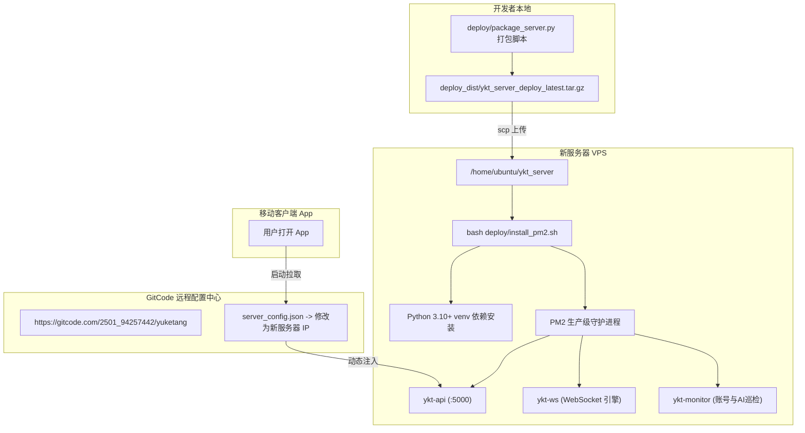

# 雨课堂分布式后台服务 —— 极速迁移与运维部署指南

本文档指导如何在 **任意全新 Linux 服务器（Ubuntu / Debian / CentOS / Rocky Linux / 腾讯云 / 阿里云 / 华为云 / AWS / 搬瓦工 等）** 上从零完成后台服务的极速迁移部署，以及如何配合 GitCode 实现 **客户端 0 重新打包、0 中断无感切换**。

---

## 目录
1. [迁移核心原理与架构](#1-迁移核心原理与架构)
2. [本地一键打包与导出](#2-本地一键打包与导出)
3. [新服务器极速一键部署 (5分钟)](#3-新服务器极速一键部署-5分钟)
4. [配置环境变量 (ykt.env)](#4-配置环境变量-ykt.env)
5. [PM2 守护进程管理与开机自启](#5-pm2-守护进程管理与开机自启)
6. [服务健康检查与在线验证](#6-服务健康检查与在线验证)
7. [切换 GitCode 远程配置（客户端免更新无感切换）](#7-切换-gitcode-远程配置客户端免更新无感切换)
8. [防火墙与端口放行说明](#8-防火墙与端口放行说明)

---

## 1. 迁移核心原理与架构



---

## 2. 本地一键打包与导出

在本地项目根目录运行一键打包脚本：

```bash
python deploy/package_server.py
```

执行后，将在 `deploy_dist/` 目录下自动生成：
* `ykt_server_deploy_latest.tar.gz`（Linux 推荐）
* `ykt_server_deploy_latest.zip`（Windows / 通用）

包内已自动精简掉前端代码、测试虚拟环境与临时文件，仅保留后端服务运行所需的全部源码与部署脚本。

---

## 3. 新服务器极速一键部署 (5分钟)

### 第一步：将压缩包上传到新服务器

```bash
scp deploy_dist/ykt_server_deploy_latest.tar.gz ubuntu@<新服务器IP>:/home/ubuntu/
```

### 第二步：登录新服务器并解压

```bash
ssh ubuntu@<新服务器IP>

# 创建并进入服务目录
mkdir -p /home/ubuntu/ykt_server
cd /home/ubuntu/ykt_server
tar -zxvf /home/ubuntu/ykt_server_deploy_latest.tar.gz -C .
```

### 第三步：安装基础运行环境（若服务器为全新纯净系统）

```bash
# Ubuntu / Debian 系统：
sudo apt-get update
sudo apt-get install -y python3 python3-venv python3-pip nodejs npm curl

# 安装全局 PM2 守护进程管理器
sudo npm install -g pm2
```

### 第四步：执行一键部署安装脚本

```bash
bash deploy/install_pm2.sh
```

脚本将自动执行：
1. 校验核心服务文件完整性
2. 创建独立 Python 虚拟环境 `venv`
3. 自动安装 `requirements.txt` 中所有核心依赖（Flask、waitress、websockets、aiohttp、openai、google-genai 等）
4. 初始化数据安全目录 `data/` 与日志目录 `logs/`
5. 启动 PM2 托管的 3 大后台服务（API 服务、WebSocket 答题引擎、全自动巡检引擎）

---

## 4. 配置环境变量 (ykt.env)

后台配置统一保存在 `/home/ubuntu/ykt_server/ykt.env` 中。  
编辑配置文件：

```bash
nano /home/ubuntu/ykt_server/ykt.env
```

核心配置项说明：
```ini
# 服务端口与主机
API_HOST=0.0.0.0
API_PORT=5000
API_WORKERS=4

# 管理员核心主密钥（用于新增租户密钥与管理控制台）
ADMIN_KEY=your_admin_master_key

# 微信推送 WxPusher 巡检告警配置（可选）
WXPUSHER_APP_TOKEN=AT_xxxxxx
WXPUSHER_TOPIC_ID=12345
WXPUSHER_ADMIN_UID=UID_xxxxxx

# AI 多模态大模型配置（支持 SiliconFlow / NVIDIA / DeepSeek / Gemini 等）
AI_PROVIDER=siliconflow
AI_API_KEY=sk-your-ai-api-key-sample
AI_BASE_URL=https://api.siliconflow.cn/v1
AI_MODELS=Qwen/Qwen2.5-VL-72B-Instruct
NVIDIA_API_KEY=nvapi-your-nvidia-api-key-sample
SILICONFLOW_API_KEY=sk-your-siliconflow-api-key-sample
```

保存后热重载生效：
```bash
pm2 restart ecosystem.config.cjs --update-env
```

---

## 5. PM2 守护进程管理与开机自启

### 常用运维命令
```bash
# 查看所有后台服务状态
pm2 status

# 实时查看综合日志
pm2 logs

# 查看指定服务日志
pm2 logs ykt-api
pm2 logs ykt-ws
pm2 logs ykt-monitor

# 重启全部服务
pm2 restart ecosystem.config.cjs --update-env

# 停止全部服务
pm2 stop ecosystem.config.cjs
```

### 配置开机自启
```bash
# 1. 运行自启配置命令（根据提示执行 sudo 命令）
pm2 startup

# 2. 保存当前运行的服务列表
pm2 save
```

---

## 6. 服务健康检查与在线验证

在新服务器或本地电脑上直接运行以下 curl 命令测试连通性：

```bash
# 1. 检查服务器基本状态
curl -s http://<新服务器IP>:5000/api/status

# 预期返回：{"code":0,"data":{"status":"ok","version":"2.6.1"}}

# 2. 检查多模态 AI 引擎健康状态
curl -s http://<新服务器IP>:5000/api/ai/health

# 预期返回：Gemma-4 / Qwen3.8 等模型连通延迟与健康评分
```

---

## 7. 切换 GitCode 远程配置（客户端免更新无感切换）

当新服务器部署并验证无误后，**无需重新打包分发任何 App 安装包**，只需修改 GitCode 上的配置文件：

1. 打开 `https://gitcode.com/your-org/yuketang/blob/main/server_config.json`
2. 点击编辑按钮，将 `server_url` 修改为新服务器地址：
   ```json
   {
     "server_url": "http://<新服务器IP>:5000",
     "backup_server_url": "http://<新服务器IP>:5000",
     "updated_at": "2026-08-21T05:30:00Z",
     "description": "雨课堂自动签到与AI答题分布式同步服务器配置",
     "version": "1.0.1"
   }
   ```
3. 提交保存。

**所有用户的手机 App 在下一次打开时，均会自动拉取并切换至新服务器 IP！**

---

## 8. 防火墙与端口放行说明

请确保新服务器的安全组（Security Group）或防火墙（UFW / firewalld）已放行相应端口：

| 端口号 | 协议 | 用途 | 是否必选 |
| :--- | :--- | :--- | :--- |
| **5000** | TCP (HTTP) | 后台 API 同步与管理接口 | 必选 |
| **80 / 443** | TCP (HTTP/HTTPS) | Nginx 反向代理端口（若配置 SSL） | 可选 |
| **22** | TCP (SSH) | SSH 远程管理端口 | 必选 |

Ubuntu UFW 快速放行命令：
```bash
sudo ufw allow 5000/tcp
sudo ufw allow 22/tcp
sudo ufw enable
```
