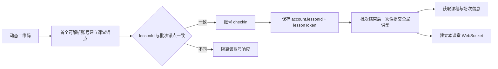

# 雨课堂签到助手 v1.1.0：课堂上下文与课件答题架构

## 1. 本版解决的问题

1. **补签串课**：`lessonId` 不再由每个并发账号直接写入全局状态。
2. **旧令牌串用**：每个账号的 `lessonToken` 必须和自己的 `lessonId` 一起保存；答题页只启用当前课堂的账号。
3. **课程身份不清晰**：答题页展示课程名、课堂场次、班级、教师和课堂 ID。
4. **课件兼容性**：同时解析 `slides[].problem`、顶层 `problems[].slideIndex`、`cover/coverAlt/thumbnail` 和 `shapes[].URL`。
5. **实时连接串流**：WebSocket 消息按 `lessonid` 隔离；课堂切换会关闭旧连接、清空旧题目和旧课件缓存。
6. **题型码修正**：依照反编译模型使用 `0..4` 的官方 `problemType`，提交时保持原始数字语义。

## 2. 课堂上下文所有权



核心不变量：

- 新签到批次由首个可解析账号建立唯一课堂锚点。
- 补签批次在扫码前已经锁定原课堂。
- 账号级请求只更新该账号，不直接更新 `currentLessonId`。
- 至少一个账号成功后，批次才会一次性提交全局课堂。
- `account.lessonId !== currentLessonId` 的账号不会进入答题队列，也不会被选择为 WebSocket 探针。

## 3. 运行链路

### 签到

1. `POST /api/v3/app/scan`：二维码动态载荷换取 `lessonId`。
2. 批次课堂守卫校验 `lessonId`。
3. `POST /api/v3/lesson/checkin`：取得账号自己的 `lessonToken`。
4. 持久化 `account.lessonId`、`account.lessonToken`、`account.lessonContext`。
5. 批次完成后绑定课堂并启动答题监视。

### 课程身份

通过 `GET /api/v3/lesson/detail` 解析：

- `data.basic.lessonId/title/teacher`
- `data.classroom.name/courseName`

元数据保存在 `last_lesson_context_v2`，冷启动可直接显示，联网后自动刷新。

### WebSocket

- 地址：`wss://www.yuketang.cn/wsapp/`
- 握手：`hello(userid, role, auth, lessonid)`
- 心跳：`detectlesson`
- 题目：`unlockproblem`、`sendsproblem`、`sproblemshown`、`probleminfo`
- 课件：`hello`、`showpresentation`、`slidenav`、`presentationupdated`
- 截止：`extendtime`、`problemfinished`、`lessonfinished`

所有带课堂 ID 的入站消息都会先与当前课堂比较，其他课堂消息直接隔离。

### 课件加载

`GET /api/v3/lesson/presentation/fetch?presentation_id=...` 的解析顺序：

1. 按 `problemId` 匹配 `slides[].problem`。
2. 按 `slideId` 匹配 `id/lessonSlideID/lesson_slide_id`。
3. 按 `slideIndex` 匹配。
4. 兼容顶层 `problems[].slideIndex`。
5. 图片依次选择 `cover → coverAlt → thumbnail → shapes[].URL`。
6. 支持完整 HTTPS、协议相对地址、站内相对地址和对象型资源字段。

## 4. 文件职责

- `pages/index/index.vue`：页面、扫码批次编排、账号持久化、课堂批次提交。
- `pages/index/answer-engine.js`：课堂状态机、课程详情、WebSocket、倒计时、批量答题。
- `pages/index/answer-engine-utils.js`：课堂批次守卫、课程详情解析、课件解析和资源地址归一化。
- `tests/answer-engine-utils.test.mjs`：批次锁、课程详情和课件多结构解析测试。
- `tests/answer-engine-context.test.mjs`：账号令牌和课堂上下文隔离测试。

## 5. 本地验证

使用 Node.js 执行：

```powershell
node tests/answer-engine-utils.test.mjs
node tests/answer-engine-context.test.mjs
```

当前测试覆盖 28 个断言，包括补签课堂锁、其他课堂 WebSocket 响应隔离、课程元数据提取、私有 CDN 地址、课件封面回退、官方题型码和账号就绪状态切换。

## 6. HAR 说明

`C:\Users\CWYWJG\Downloads\8.8.8.8_2026_07_18_05_22_37.har` 共 92 条记录，应用层内容均为 HTTPS `CONNECT` 隧道，未包含解密后的 URL 路径、请求体、响应体或 WebSocket 帧。文件仍确认运行期间连接了：

- `www.yuketang.cn`
- `fe-static-yuketang.yuketang.cn`
- `rain-private-qn.yuketang.cn`

课件资源解析已覆盖这些 HTTPS 主机的完整地址和协议相对地址。
