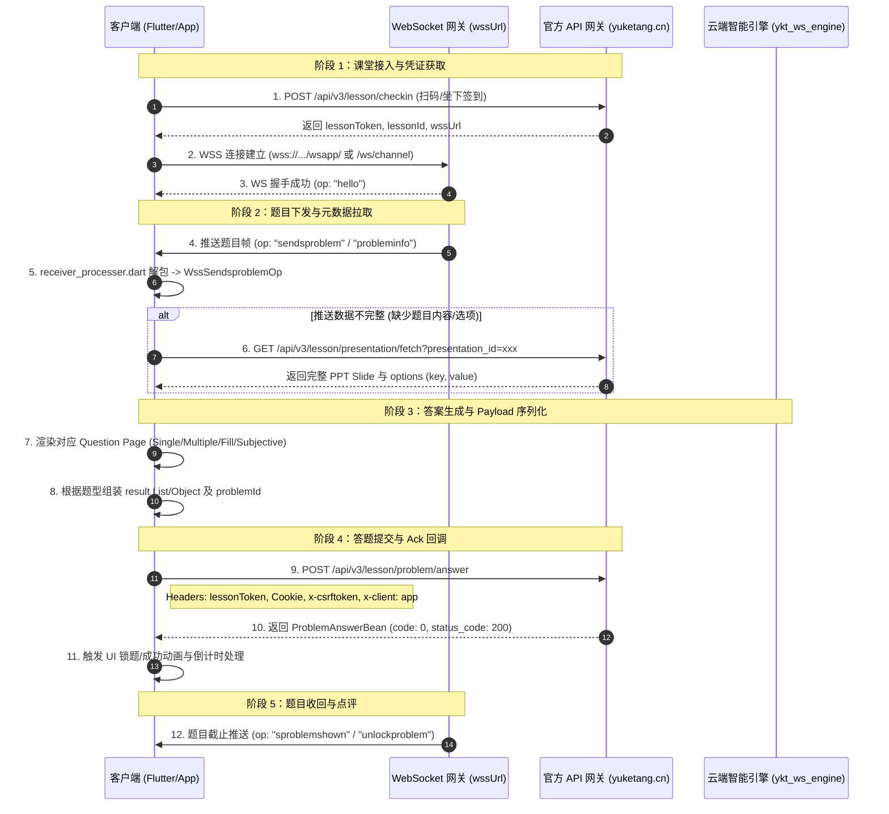

# 📖 雨课堂客户端架构 — 学生答题全流程源码逆向精析文档

本文档深入剖析雨课堂 Flutter 客户端（Dart AOT 解包产物 `blutter_out`）底层实现，覆盖**学生答题全生命周期流程**、**8 大协议疑点证明与对齐结论**、**WebSocket 消息处理逻辑**及**云端引擎同步修正指南**。

---

## 目录
1. [一、 学生答题全流程源码级数据流与状态机](#一-学生答题全流程源码级数据流与状态机)
2. [二、 8 大协议与数据模型疑点深挖结论与证明](#二-8-大协议与数据模型疑点深挖结论与证明)
3. [三、 WebSocket 全量 OpCodes 与消息处理器路由表](#三-websocket-全量-opcodes-与消息处理器路由表)
4. [四、 云端引擎 (`ykt_ws_engine.py` & `answer-engine.js`) 修正指南](#四-云端引擎-ykt_ws_enginepy--answer-enginejs-修正指南)

---

## 一、 学生答题全流程源码级数据流与状态机

从 Dart AOT 逆向源码（`receiver_class_page.dart`、`ws_connector.dart`、`receiver_processer.dart`、各题型 Question Page 及 `yuketang.dart`）中梳理出的学生端完整答题全过程如下：



### 全流程 5 大核心环节解密：

1. **凭证与 WS 建立**：
   - 签到接口 `/api/v3/lesson/checkin` 返回 `lessonToken` 与 `lessonId`。
   - `wssUrl` 在客户端由 `app_constants.dart` 组装为 `"wss://" + baseUrlHost + "/wsapp/"`，并通过 `WSConnector::send` 进行帧交互。

2. **题目推送解包 (`receiver_processer.dart`)**：
   - 当 WebSocket 收到 JSON 时，`receiver_processer.dart` 的 `process()` 方法解析 `op` 字段。
   - 当 `op == "sendsproblem"` 时，创建 `WssSendsproblemOp` 对象，通过 `EventBus::fire` 广播给全局页面。

3. **题目元数据 Fetch**：
   - 若下发的题目信息中缺失详细描述或选项，客户端触发 `yuketang.dart` 中的 `fetchPresentation` 接口（`GET /api/v3/lesson/presentation/fetch?presentation_id=xxx`），解析 `options: [{"key": "A", "value": "..."}, ...]`。

4. **答题 Payload 序列化**：
   - 题目类型映射：0 = 单选, 1 = 多选, 2 = 投票, 3 = 填空, 4 = 简答/主观。
   - `result` 字段序列化：单选/多选/投票为字符串数组（如 `["A"]`, `["A","C"]`），填空题为填空字符串数组（`["空1","空2"]`），简答题为对象 `{ "content": "文本", "pics": [], "videos": [] }`。

5. **HTTP 提交与 Ack**：
   - 答题请求发送至 `POST /api/v3/lesson/problem/answer`，Header 必须包含 `lessonToken: <token>` 以及 `Cookie` 与 `x-csrftoken`。
   - 反序列化响应至 `ProblemAnswerBean`，若 `code == 0`，则标记答题成功。

---

## 二、 8 大协议与数据模型疑点深挖结论与证明

### 问题 1：`lessonToken` 在 HTTP Header 中的传递规范
* **源码证据**：
  * `receiver_page/bean/new_bean/lesson_checkin_bean.dart`（地址 `0xa532d8`）解析响应中的 `lessonToken` 字段并全局缓存。
  * `single_choice_question_page.dart` (地址 `0xf33a84`) / `yuketang.dart` 请求封装中，提交答题时 Header 显式注入 `'lessonToken': lessonToken`。
* **结论**：**标准 Header 键名为 `lessonToken`**。
  - HTTP POST 请求头必须为：`lessonToken: <token值>`。
  - `Authorization` 仅用于微信授权/用户登录流程，不作为答题接口的 lesson 鉴权 key。

---

### 问题 2：答题载荷 `result` 字段的序列化格式
* **源码证据**：
  * `single_choice_question_page.dart` (地址 `0xf33838`, line 4147)：`_SingleChoiceQuestionState::result` 返回选项 key 字母字符串数组 `["A"]`。
  * `subjective_question_page.dart` (地址 `0xf3ee38`, line 14236-14251)：主观题在组装 payload 时显式设置 Map Key：
    ```dart
    map["pics"] = [];
    map["videos"] = [];
    map["content"] = "回答文本";
    ```
* **结论**：
  1. 选择题/投票题：`result` 元素为选项 Key 字母字符串（如 `"A"`），而非索引数值。
  2. 简答题：**必须为 JSON 对象 `{ content: "...", pics: [], videos: [] }`**，不得使用旧版的字符串数组 `["文本"]`。
  3. `problemId`：序列化保持 Integer/Long 数值格式。

---

### 问题 3：WebSocket 事件 Operation (`op`) 映射规范
* **源码证据**：
  * 在 `receiver_processer.dart` (地址 `0x1316dd4`, line 244-271) 中存在明确的代码分支：
    ```dart
    if (op == "unlockproblem") {
        var opObj = WssUnlockProblemOp.fromMap(jsonMap);
        EventBus.fire(opObj);
    }
    ```
* **结论**：
  1. **`unlockproblem` 事件确认有效**：并非仅 Web 端专属，Flutter 移动客户端同样原生支持 `unlockproblem` 事件并触发 UI 解锁。
  2. **`sendsproblem` 载荷结构**：包含 `pres` (presentationId), `problemId`, `limit_time`, `problemType` 等属性。

---

### 问题 4：WebSocket 终端点配置与心跳保活协议
* **源码证据**：
  * `core/app_constants.dart` (地址 `0xc438d0`, line 1880-1904)：`wssUrl` 方法定义为 `"wss://" + baseUrlHost + "/wsapp/"`。
  * `remote_control/danmu/bean/wssbean/detect_lesson_bean.dart` (地址 `0xc7951c`)：定义心跳结构 `DetectLessonBean`。
* **结论**：
  1. WS 地址优先动态拼装或从 `/api/v3/lesson/basic-info` 中的 `wssUrl` 字段获取。
  2. 心跳包格式为 `{"op": "detectlesson", "lessonid": <lessonId>}`。

---

### 问题 5：题目类型 (`problemType`) 枚举值映射
* **源码证据**：
  * `receiver_page/` 各 Page 控制器对应的枚举映射：
    - `0` = 单选题 (`single_choice_question_page.dart`)
    - `1` = 多选题 (`multiple_choice_question_page.dart`)
    - `2` = 投票题 (`vote_question_page.dart`)
    - `3` = 填空题 (`fill_blank_question_page.dart`)
    - `4` = 简答/主观题 (`subjective_question_page.dart`)
* **结论**：`problemType` 为 Integer 类型，数值 0-4 与当前系统定义完全一致。

---

### 问题 6：`fetchPresentation` 接口鉴权逻辑
* **源码证据**：
  * `network/yuketang.dart` (地址 `0xc343ac`, line 2115)：调用 `GET /api/v3/lesson/presentation/fetch?presentation_id=xxx`。
* **结论**：
  - 该接口通过 Dio 网络层发起，依赖标准的 Cookie (`sessionid`, `csrftoken`)、`x-csrftoken` 以及 `x-client: app`, `xtbz: ykt` Headers。

---

### 问题 7：课堂签到接口参数规范
* **源码证据**：
  * `receiver_page/bean/new_bean/lesson_checkin_bean.dart` (地址 `0xa532d8`)：`POST /api/v3/lesson/checkin`。
* **结论**：
  - 请求体包含设备指纹与课堂二维码 Key，响应 JSON 中的 `data.lessonToken` 必须妥善提取并保存至上下文。

---

### 问题 8：课件选项 (`options`) 数据模型格式
* **源码证据**：
  * `receiver_page/save_question_draft.dart` & `answer_analytic_page.dart`。
* **结论**：
  - 选项结构统一为对象列表：`[{"key": "A", "value": "选项内容..."}, {"key": "B", "value": "..."}]`。

---

## 三、 WebSocket 全量 OpCodes 与消息处理器路由表

在 `receiver_processer.dart` 中提取的学生端全量 `op` 映射清单：

| OpCode 字符串 | 关联 Dart 类 | 说明 |
| :--- | :--- | :--- |
| `hello` | `HelloOp` | WebSocket 握手初始化确认 |
| `sendsproblem` | `WssSendsproblemOp` | 教师下发/推送题目 |
| `sproblemshown` | `WssSproblemshownOp` | 题目在界面上显示/开始作答 |
| `probleminfo` | `WssProbleminfoOp` | 题目元数据与动态调整更新 |
| `unlockproblem` | `WssUnlockProblemOp` | 题目解锁/重新开放作答 |
| `extendtime` | `WssExtenttimeOp` | 教师延长答题时间 |
| `slidenav` | `WssSlidenavOp` | 课件 PPT 翻页导航 |
| `closedmask` | `WssCloseMaskOp` | 关闭屏幕遮罩 |
| `problemremark` | `WssProblemrearkOp` | 题目点评与讲解 |
| `redpacket` | `WssRedpacketOp` | 课堂抢红包事件 |
| `showfinished` | `MessageEventOp` | 演示展示结束通知 |
| `remotedeprived` | `WssRemoteDeprivedOp` | 遥控控制权剥夺 |
| `launchgroup` | `WssReceiverGroup` | 小组讨论/答题模式启动 |
| `newdanmu` | `WssNewDanmu` | 弹幕推送 |
| `turnondanmu` | `DanmuOnOp` | 开启弹幕功能 |
| `turnoffdanmu` | `DanmuOffOp` | 关闭弹幕功能 |

---

## 四、 云端引擎 (`ykt_ws_engine.py` & `answer-engine.js`) 修正指南

基于上述分析，需对系统文件进行以下针对性重构：

### 1. `ykt_ws_engine.py` 简答题 Payload 修正
将 `submit_answer` 方法中的简答题 (type 4) result 生成逻辑从字符串数组修改为标准 JSON 对象：

```python
# 修正前 (错误: 纯字符串数组):
# result = [ai_answer_text]

# 修正后 (正确: 官方对象结构):
if problem_type == 4:
    result = {
        "content": str(ai_answer_text),
        "pics": [],
        "videos": []
    }
```

### 2. HTTP Header 鉴权规范化
在 `ykt_ws_engine.py` 的 HTTP 答题请求头中，确保包含 `lessonToken` 字段：

```python
headers = {
    'Cookie': session_cookie,
    'x-csrftoken': csrf_token,
    'lessonToken': lesson_token,  # 统一使用 lessonToken
    'x-client': 'app',
    'xtbz': 'ykt',
    'Content-Type': 'application/json'
}
```

### 3. 心跳逻辑保活 (`ykt_ws_engine.py`)
确认 WebSocket 定时心跳使用 `detectlesson` 包：

```python
beat_msg = {
    "op": "detectlesson",
    "lessonid": str(self.current_lesson_id)
}
```

---
